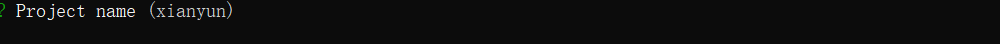
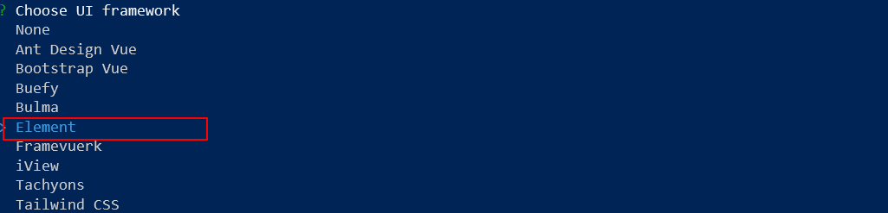
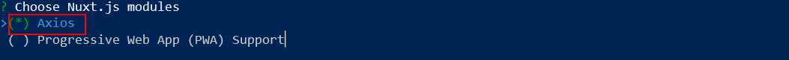
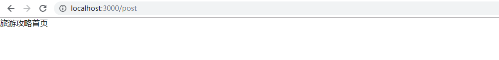

# 闲云旅游项目课程

# 第2章 环境搭建


## 初始化项目

根据下面的步骤来初始化一个nuxtjs项目


### 安装

切换至存放项目的路径, 如E盘：

```
cd E:
```

然后使用官网提供的脚手架工具 [create-nuxt-app](https://github.com/nuxt/create-nuxt-app)，创建一个`nuxtjs`项目。

```
npx create-nuxt-app xianyun
```

> 注意：在`NPM`版本5.2.0默认安装了`npx`，在命令行窗口输入`npm --version`可查看当前版本号


需要等待片刻安装依赖的下载，下载完成后可以看到下面的提示框，要求输入项目名称。



这里和接下来的提示都不需要输入任何内容，一直回车即可，注意下面的两个选项：


2.

1：

`UI`框架我们选择通用的`Element-ui`。




2：

接下来我们来选择安装一下额外的功能包，选择安装Axios（`要按下空格键选中`），继续回车下一步




**其他的统一回车跳过即可。**


### 启动

当运行完时，项目将安装所有依赖项，因此下一步是启动项目:

```
$ cd xianyun
$ npm run dev
```


> 注意：此时运行项目可能会遇到以下错误提示`HTMLElement is not define nuxt.js`，原因是在`Nuxtjs`的服务器环境加载`Element-ui`遇到兼容问题抛出的错误，（如不报错则表示bug已修复），解决办法如下：

> 下载指定版本的`element-ui`
>
> ```
> npm install --save element-ui@2.4.11
> ```
>

项目初始化就完成了。


## 项目文件结构

### 文件结构

官网文档： <https://zh.nuxtjs.org/guide/directory-structure>

```
- xianyun 项目根目录
	- assets 		资源目录
	- components 	组件目录
	- layouts 		布局组件目录
	- middleware 	中间件目录
	- pages			页面目录
	- plugins		插件目录
	- static		静态文件目录
	- Store			Vuex 状态树 文件
	- nuxt.config.js	Nuxt.js 应用的个性化配置
	- package.json	依赖关系和对外暴露的脚本接口
```

### 别名说明

| 别名         | 目录                                                      |
| ------------ | --------------------------------------------------------- |
| `~` 或 `@`   | [src目录](https://zh.nuxtjs.org/api/configuration-srcdir) |
| `~~` 或 `@@` | [根目录](https://zh.nuxtjs.org/api/configuration-rootdir) |

默认情况下，`src目录`和`根目录`相同

> 注意：**在您的 `vue` 模板中, 如果你需要引入 `assets` 或者 `static` 目录, 使用 `~/assets/your_image.png` 和 `~/static/your_image.png`方式。


## 基本配置

### 修改/删除默认文件

Nuxtjs初始化项目时给我们提供了两个演示文件，对我们接下来的项目开发没任何作用，分别是`pages/index.vue`和`components/logo.vue`。

修改如下：

**1.首先是`pages/index.vue`**

```vue
<template>
    <div>
        首页
    </div>
</template>

<script>
export default {

}
</script>

<style>

</style>
```

**2.删除`components/logo.vue`文件**

> 现在访问首页`http://localhost:3000/`，就只能看到`首页`两个字了。


### 创建页面目录

接下来创建项目结构目录，方便以后的项目模块扩展。

在`pages`目录下新建文件夹，文件夹分别对应接下来要开发的业务模块

```
- ... // 其他文件

- pages
	- index.vue 		// 已存在的首页文件
	- post				// 存放旅游攻略模块的文件夹
		- index.vue		// 旅游攻略模块首页文件
	- air				// 存放机票模块的文件夹
		- index.vue		// 机票模块首页文件
	- hotel				// 存放酒店模块的文件夹
		- index.vue		// 机票模块首页文件
	- user				// 存放用户模块的文件夹
		- login.vue 	// 用户登录注册页面
		
- ... // 其他文件
```

如果你已经新增了上面的文件，我们可以直接通过路由访问`pages`下的页面，查看页面是否新增成功。比如我们修改`post/index.vue`内容如下：

```vue
<template>
    <div>
        旅游攻略首页
    </div>
</template>

<script>
export default {

}
</script>

<style>

</style>
```

在浏览器中访问地址`http://localhost:3000/post`，页面显示如下：



> 1. 顺便给`air/index.vue`, `hotel/index.vue`也新增上面的内容吧，不过需要修改下文字方便区分页面。

> 2. Nuxtjs的页面访问规则和浏览器的`SPA`机制不同，在Nuxtjs中不需要路由配置，`pages`下的页面可以直接通过路径访问，默认查找`index.vue`


### 创建组件目录

虽然现在还没开始开发页面，但是我们可以预测未来的页面中肯定存在很多可以独立封装的组件，所以我们现在可以给`未来的组件`新建存放目录.

在`components`文件夹中新建文件夹：

```
- ... 			// 其他文件

- components	// 存放公共组件的文件夹
	- post		// 存放旅游攻略模块组件的文件夹
	- air		// 存放机票模块组件的文件夹
	- hotel		// 存放酒店模块组件的文件夹
	- user		// 存放用户模块组件的文件夹
	
- ... 			// 其他文件
```


### 修改配置

#### 页面过渡效果样式

目前还没涉及到页面的跳转，但不妨碍我们给项目配置预先做好铺垫，这份配置只是为了页面切换时优化用户体验设计的，并不是必须的。

在`assets/`目录下创建这个文件`assets/main.css`，添加以下样式：

```css
/* 页面切换时候过渡样式 */
.page-enter-active, .page-leave-active {
    transition: opacity .5s;
}

/* 打开时候过渡样式 */
.page-enter, .page-leave-active {
    opacity: 0;
}

/* 页面顶部页面加载进度条 */
.nuxt-progress{
    background:#409eff;
    height: 1px;
}
```

> 只是新建了样式文件还不能产生效果，需要在`nuxt.config.js`配置文件中加载该文件才能生效。参考下一小结
>
> 参考文档： `https://zh.nuxtjs.org/guide/routing#过渡动效`


#### 修改配置文件

配置文件`nuxt.config.js`对项目进行了全局配置，对每个页面都生效。

复制下面配置替换项目的`nuxt.config.js`文件，如果想手动修改的话可以查看`中文注释行(#10 #18 #32 #56)`

```js
import pkg from './package'

export default {
  mode: 'universal',

  /*
  ** Headers of the page
  */
  head: {
    title: "闲云旅游网", // 修改title
    meta: [
      { charset: 'utf-8' },
      { name: 'viewport', content: 'width=device-width, initial-scale=1' },
      { hid: 'description', name: 'description', content: pkg.description }
    ],
    link: [
      { rel: 'icon', type: 'image/x-icon', href: '/favicon.ico' },
      { rel: 'stylesheet', type: 'text/css', href: '//at.alicdn.com/t/font_1168872_ehvuah8v57g.css'} // 新增全局字体样式
    ]
  },

  /*
  ** Customize the progress-bar color
  */
  loading: { color: '#fff' },

  /*
  ** Global CSS
  */
  css: [
    'element-ui/lib/theme-chalk/index.css',
    'assets/main.css' // 新增自定义的页面过渡样式（文件来自3.4.1）
  ],

  /*
  ** Plugins to load before mounting the App
  */
  plugins: [
    '@/plugins/element-ui'
  ],

  /*
  ** Nuxt.js modules
  */
  modules: [
    // https://axios.nuxtjs.org/setup
    '@nuxtjs/axios'
  ],

  /*
  ** Axios module configuration
  */
  axios: {
    // See https://github.com/nuxt-community/axios-module#options
    // baseURL: "http://157.122.54.189:9095" // 新增备用地址
    baseURL: "http://127.0.0.1:1337" // 新增axios默认请求路径 		  
  },

  /*
  ** Build configuration
  */
  build: {
    transpile: [/^element-ui/],

    /*
    ** You can extend webpack config here
    */
    extend(config, ctx) {
    }
  },
}
```

> 注意：修改`nuxt.config.js`记得要重启项目


### 添加less

预编译样式我们选择`less`，相关配置`nuxtjs`已经帮我们配置好了，不需要改动`webpack`的配置文件，只需要安装依赖包即可

```
npm install --save less less-loader 
```


## 总结

1. 初始化项目命令：

   ```
   // 安装，注意选项选择
   npx create-nuxt-app xianyun
   
   // 启动
   $ cd xianyun
   $ npm run dev
   ```

2. 新建项目文件结构
3. 修改默认配置文件`nuxt.config.js` ,注意修改配置文件要重启项目才生效


## Nuxt和普通的Vue

1. `Nuxt`是同构程序，这里的同构指的是一套代码，可以在浏览器运行，也可以在服务器（`Nodejs`）运行，也就是说可以同时使用浏览器的`API`和`Nodejs`的`API`。
2. 普通的`Vue`页面只能使用浏览器的`API`，即使在`Nodejs`环境下开发也只是使用`Webpack`来编译打包。

3. `Nuxt`是前后端框架的集合，前端采用`Vue`，后端可选框架有`Express、hapi`等，所以可以理解为`Vue`是一个页面模板的存在，类似于`art-template`
4. `Nuxt`支持单页和多页应用。

> 注意：虽然`Nuxt`确实很强大，但是目前市面上应用的却不是很多，因为`nodejs`作为服务器端主力语言目前还是相对较少的，更多的还是`java，php`等，所以我们会把精力集中在的功能业务开发上，以及一些`Vue`未接触过的用法。


