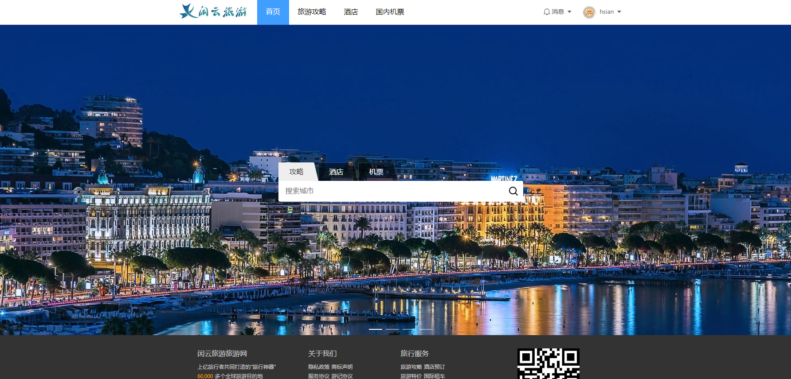

# 闲云旅游项目课程

# 第3章 首页开发




## 初始化默认布局

`nuxtjs`提供了一个公共布局组件`layouts/default.vue`，该布局组件默认作用于所有页面，所以我们可以在这里加上一些公共样式，在下一小结中还会导入公共组件

替换`layouts/default.vue`代码如下：

```vue
<template>
  <div>
    <!-- 内容占位组件 -->
    <nuxt />
  </div>
</template>

<script>
export default {

}
</script>

<style lang="less">
html {
  font-family: 'Source Sans Pro', -apple-system, BlinkMacSystemFont, 'Segoe UI',
    Roboto, 'Helvetica Neue', Arial, sans-serif;
  font-size: 16px;
  word-spacing: 1px;
  -ms-text-size-adjust: 100%;
  -webkit-text-size-adjust: 100%;
  -moz-osx-font-smoothing: grayscale;
  -webkit-font-smoothing: antialiased;
  box-sizing: border-box;
}

*{
  margin:0; 
  padding:0;
}
ul, li, ol{
  list-style:none;
}
a{
  text-decoration:none;
  color:inherit;
}
a:hover{

}
em,i{
  font-style: normal;
}
</style>

```


## 新建公共组件

### 思路

1. 在`components`中新建应用统一的头部组件和页脚组件。
2. 在默认布局中`layouts/default.vue`中导入公共组件。

> 组件约定：公共组件不需要放到子文件夹中
>
> 下拉菜单组件文档: <https://element.eleme.cn/#/zh-CN/component/dropdown#ji-chu-yong-fa>


### 实现步骤

#### 头部组件

在`components`文件夹中新建头部组件`components/header.vue`。

```vue
<template>
    <header class="header">
        <el-row type="flex" justify="space-between" class="main">

            <!-- logo -->
            <div class="logo">
                <nuxt-link to="/">
                    
                </nuxt-link>
            </div>

            <!-- 菜单栏 -->
            <el-row type="flex" class="navs">
                <nuxt-link to="/">首页</nuxt-link>
                <nuxt-link to="/post">旅游攻略</nuxt-link>
                <nuxt-link to="/hotel">酒店</nuxt-link>
                <nuxt-link to="/air">国内机票</nuxt-link>  
            </el-row>

            <!-- 登录/用户信息 -->
            <el-row type="flex" align="middle">

                <!-- 如果用户存在则展示用户信息，用户数据来自store -->
                <el-dropdown v-if="false">
                    <el-row type="flex" align="middle" class="el-dropdown-link">
                        <nuxt-link to="#">
                            
                            用户名
                        </nuxt-link>
                        <i class="el-icon-caret-bottom el-icon--right"></i>
                    </el-row>
                    <el-dropdown-menu slot="dropdown">
                        <el-dropdown-item>
                           <nuxt-link to="#">个人中心</nuxt-link>
                        </el-dropdown-item>
                        <el-dropdown-item>
                            <div @click="handleLogout">退出</div> 
                        </el-dropdown-item>
                    </el-dropdown-menu>
                </el-dropdown>

                <!-- 不存在用户信息展示登录注册链接 -->
                <nuxt-link to="/user/login" class="account-link" v-else>
                    登录 / 注册 
                </nuxt-link>
            </el-row>
        </el-row>
    </header>
</template>
<script>
export default {
    methods: {
        // 用户退出
        handleLogout(){},
    }
}
</script>
<style scoped lang="less">
    .header{
        height: 60px;
        line-height:60px;
        background:#fff;
        border-bottom: 1px #ddd solid;
        box-shadow:0 3px 0 #f5f5f5;
        box-sizing: border-box;

        .main{
            width:1000px;
            margin:0 auto;
        }

        .logo{
            width:156px;
            padding-top:8px;

            img{
                display: block;
                width:100%;
            }
        }

        .navs{
            margin: 0 20px;
            flex:1;

            a{
                display:block;
                padding:0 20px;
                height:60px;
                box-sizing: border-box;

                &:hover,&:focus, &:active {
                    border-bottom:5px #409eff solid;
                    color:#409eff;
                }
            }

            /deep/ .nuxt-link-exact-active{
                background:#409eff;
                color:#fff!important;
            }
        }

        .message{
            height:36px;
            line-height:1;
            cursor:pointer;
            .el-icon-bell{
                margin-right:2px;
                font-size:18px;      
            }
        }

        .el-dropdown-link{
           margin-left:20px;

           &:hover{
               img{
                    border-color: #409eff;
               }
            }

           a{
               display:block;
           }

            img{

                width:32px;
                height:32px;
                vertical-align: middle;
                border:2px #fff solid;
                border-radius:50px;
            }
        }

        .account-link{
            font-size: 14px;
            margin-left:10px;
            color:#666;

            &:hover{
                color:#409eff;
                text-decoration: underline;
            }
        }
    } 
</style>
```

> 注意: 样式中的` /deep/ .nuxt-link-exact-active`是菜单高亮时的颜色。


在`layouts/default.vue`中导入头部组件

```vue
<template>
  <div>
    <!-- 头部组件 -->
    <Header/>
    <!-- 内容占位组件 -->
    <nuxt />
  </div>
</template>

<script>
// 导入头部组件
import Header from "@/components/header"

export default {
  // 注册组件
  components: {
    Header
  }
}
</script>
<style lang="less">
 /* 省略样式 */
</style>    
```

> 实现`登录注册功能`后再回来判断显示用户信息还是登陆注册按钮。


#### 页脚组件

在`components`文件夹中新建头部组件`components/footer.vue`。

```vue
<template>
    <div class="footer-wrapper">
        <div class="footer">
            <el-row class="info-list">
                <el-col :span="6" :offset="1">
                    <h5>闲云旅游旅游网</h5>
                    <p>上亿旅行者共同打造的"旅行神器"</p>
                    <p><span>60,000</span> 多个全球旅游目的地</p>
                    <p><span>600,000</span> 个细分目的地新玩法</p>
                    <p><span>760,000,000</span> 次攻略下载</p>
                    <p><span>38,000</span> 家旅游产品供应商</p>
                </el-col>
                 <el-col :span="5">
                    <h5>关于我们</h5>
                    <p>隐私政策 商标声明</p>
                    <p>服务协议 游记协议</p>
                    <p>商城平台服务协议</p>
                    <p>网络信息侵权通知指引</p>
                    <p>闲云旅游旅游网服务监督员</p>
                    <p>网站地图加入闲云旅游</p>
                </el-col>
                <el-col :span="5">
                    <h5>旅行服务</h5>
                    <p>旅游攻略 酒店预订</p>
                    <p>旅游特价 国际租车</p>
                    <p>旅游问答 旅游保险</p>
                    <p>旅游指南 订火车票</p>
                    <p>旅游资讯 APP下载</p>
                </el-col>
                <el-col :span="6" class="scan">
                    <p>
                        
                    </p>
                    关注我们
                </el-col>
            </el-row>

            <div class="licence">
                京ICP备08001421号 京公网安备110108007702 Copyright © 2016-2019 博学谷 All Rights Reserved
            </div>
        </div>
    </div>
</template>

<script>
export default {
    
}
</script>

<style scoped lang="less">
    .footer-wrapper{
        background:#333;
        color:#ccc;
        min-width:1000px;
    }

    .footer{
        padding-top:30px;
        margin:0 auto;
        width:1000px;
    }

    .info-list{
        h5{
            font-weight: normal;
            font-size:16px;
            margin-bottom:10px;
        }

        p{
            font-size:12px;
            line-height: 1.8;
            span{
                color:orange;
            }
        }
    }

    .scan{
        text-align: center;

        img{
            width:140px;
            height:140px;;
        }

        font-size:12px;
    }

    .licence{
        border-top:1px #666 solid;
        margin-top:20px;
        padding:50px 0;
        text-align: center;
        font-size:12px;
    }
</style>

```

在`layouts/default.vue`中导入页脚组件

```vue
<template>
  <div>
    <!-- 头部组件 -->
    <Header/>
    <!-- 内容占位组件 -->
    <nuxt />
    <!-- 页脚组件 -->
    <Footer/>
  </div>
</template>

<script>
// 导入头部组件
import Header from "@/components/header";
// 导入页脚组件
import Footer from "@/components/footer";

export default {
  // 注册组件
  components: {
    Header,
    Footer
  }
}
</script>  
```

现在可以查看最新的页面效果了。


### 总结

1. `layouts/default.vue`是默认的布局组件，会作用于任何页面。
2. 在`layouts/default.vue`中导入全局的头部组件和页脚组件


## 首页轮播图

### 练习

要求：图片居中平铺显示，小于`1000像素`时候出现滚动条（不限于img标签和背景图实现）。 


### 思路

1. 使用`Element-ui`的幻灯片组件`el-carousel`，新增首页轮播图布局。  
2. 请求后端接口替换静态图片数据


### 实现步骤

#### 新增轮播图布局

把`pages/index.vue`内容替换成以下代码：

```vue
<template>
    <div class="container">
        <!-- 幻灯片 -->
        <el-carousel 
        :interval="5000" 
        arrow="always">
            <el-carousel-item 
            v-for="(item, index) in banners" 
            :key="index">
                <div class="banner-image" 
                :style="`
                background:url(${item.url}) center center no-repeat;
                background-size:contain contain;
                `">
                </div>
            </el-carousel-item>
        </el-carousel>
    </div>
</template>

<script>
export default {
    data(){
        return {
            // 轮播图数据
            banners: [
                {
                    url: "http://157.122.54.189:9095/assets/images/th03.jfif",
                },
                {
                    url: "http://157.122.54.189:9095/assets/images/th04.jfif",
                }
            ]
        }
    }
}
</script>

<style scoped lang="less">
.container{
    min-width:1000px;
    margin:0 auto;
    position:relative;

    /deep/ .el-carousel__container{
        height:700px;
    }

    .banner-image{
        width:100%;
        height:100%;
    }
}
</style>
```

> 预览首页应该能正常显示轮播图了


#### 请求后端接口数据

接下来使用接口数据来替换本地的静态数据

> 接口地址：<http://157.122.54.189:9095/apidoc/index.html#api-Index-get_index_banners>

```vue
<script>
export default {
    data(){
        return {
            banners: [], // 轮播图数据
        }
    },
    mounted(){
        this.$axios({
            url: "/scenics/banners"
        }).then(res => {
            const {data} = res.data;
            this.banners = data;
        })
    }
}
</script>
```

替换`template`的图片地址为`$axios.defaults.baseURL`，因为接口返回的图片链接是相对链接

```vue
<!--省略代码-->
<div class="banner-image" 
     :style="`
             background:url(${$axios.defaults.baseURL}${item.url}) center center no-repeat;
             background-size:contain contain;
             `">
</div>
<!--省略代码-->
```

### 总结

1. 使用`Element-ui`的幻灯片组件`el-carousel`实现轮播图
2. 使用`this.$axios`请求后台轮播图接口
3. 在模板中使用`$axios.defaults.baseURL`替换图片地址


## 搜索跳转

### 思路

1. 添加搜索框布局

2. 搜索框`tab`切换执行不同的操作
3. 搜索跳转

### 实现步骤

#### 搜索框布局

把搜索框定位在轮播图上，在`pages/index.vue`的`template`新增以下代码：

```vue
<template>
    <div class="container">
        <!-- 幻灯片 -->
        <!-- 省略代码 -->

        <!-- 搜索框 -->
        <div class="banner-content">
            <div class="search-bar">
                
                <!-- tab栏 -->
                <el-row 
                type="flex" 
                class="search-tab">
                    <span 
                    v-for="(item, index) in options" 
                    :key="index" 
                    :class="{active: index === currentOption}"
                    @click="handleOption(index)">
                        <i>{{item.name}}</i>
                    </span>
                </el-row>
                
                <!-- 输入框 -->
                <el-row 
                type="flex" 
                align="middle" 
                class="search-input">
                    <input 
                    :placeholder="options[currentOption].placeholder" 
                    v-model="searchValue"
                    @keyup.enter="handleSearch"/>
                    <i class="el-icon-search" @click="handleSearch"></i>
                </el-row>
            </div>
        </div>
    </div>
</template>
```

在`pages/index.vue`的`script`替换如下：

```vue
<script>
export default {
    data(){
        return {
            banners: [],    // 轮播图数据
            options: [      // 搜索框tab选项
                {
                    name: "攻略", 
                 	placeholder: "搜索城市", 
                 	pageUrl: "/post?city="
                },
                {
                    name: "酒店", 
                    placeholder: "请输入城市搜索酒店", 
                    pageUrl: "/hotel?city="},
                {
                    name: "机票", 
                    placeholder: "请输入出发地", 
                    pageUrl: "/air"
                }
            ],
            searchValue: "",    // 搜索框的值
            currentOption: 0,   // 当前选中的选项        
        }
    },
    mounted(){
        this.$axios({
            url: "/scenics/banners"
        }).then(res => {
            const {data} = res.data;
            this.banners = data;
        })
    },

    methods: {
        handleOption(index){},
        handleSearch(){}
    },
}
</script>
```

在`pages/index.vue`的`style`替换如下：

```less
<style scoped lang="less">
.container{
    min-width:1000px;
    margin:0 auto;
    position:relative;

    /deep/ .el-carousel__container{
        height:700px;
    }

    .banner-image{
        width:100%;
        height:100%;
    }

    .banner-content{
        z-index:9;
        width:1000px;
        position:absolute;
        left:50%;
        top:45%;
        margin-left: -500px;
        border-top:1px transparent solid;

        .search-bar{
            width:552px;
            margin:0 auto;
        }

        .search-tab{
            .active{
                i{
                color:#333;
                }
                &::after{
                background: #eee;
                }
            }

            span{
                width:82px;
                height:36px;
                display:block;
                position: relative;
                margin-right:8px;
                cursor: pointer;

                i{
                position:absolute;
                z-index:2;
                display: block;
                width:100%;
                height:100%;
                line-height:30px;
                text-align:center;
                color:#fff;
                }

                &:after{
                position: absolute;
                left:0;
                top:0;
                display:block;
                content: "";
                width:100%;
                height:100%;
                border: 1px rgba(255,255,255,.2) solid;
                border-bottom: none;
                transform: scale(1.1,1.3) perspective(.7em) rotateX(2.2deg);
                transform-origin: bottom left;
                background: rgba(0,0,0,.5);
                border-radius:1px 2px 0 0;
                box-sizing:border-box;
                }
            }
        }

        .search-input{
            width:550px;
            height:46px;
            background:#fff;
            border-radius: 0 4px 4px 4px;
            border: 1px rgba(255,255,255,.2) solid;
            border-top:none;
            box-sizing: unset;

            input{
                flex:1;
                height:20px;
                padding: 13px 15px;
                outline: none;
                border:0;
                font-size:16px;
            }

            .el-icon-search{
                cursor :pointer;
                font-size:22px;
                padding:0 10px;
                font-weight:bold;
            }
        }
    }
}
</style>
```

完成 上面步骤可以得到搜索框的静态布局，下面我们来加入交互操作。


#### tab栏操作

实现切换效果，并且判断如果切换的机票`tab`，那么直接跳转到机票首页

编辑`methods`下的`handleOption`方法

```js
// 省略其他代码

// 切换tab栏时候触发
handleOption(index){
    // 设置当前tab
    this.currentOption = index;

    // 如果切换的机票tab，那么直接跳转到机票首页
    const item = this.options[index];
    if(item.name === "机票"){
        return this.$router.push(item.pageUrl);
    }
},
    
// 省略其他代码
```

#### 搜索跳转

确定搜索时候会跳转到当前`tab`的`pageUrl`页面路径，并且在`url`上携带上输入框的值

> 页面会根据参数进行搜索请求

```js
// 省略其他代码

// 搜索时候触发
handleSearch(){
    const item = this.options[this.currentOption];
    // 跳转时候给对应的页面url加上搜索内容参数
    this.$router.push(item.pageUrl + this.searchValue);
}
    
// 省略其他代码
```

### 总结

1. 先把搜索框定位在轮播图上。
2. 给`tab`添加切换效果，并且判断如果是机票`tab`，直接跳转到机票首页。
3. 实现搜索跳转，注意跳转的链接来自当前选中的`tab`的`pageUrl`属性，并且附带上参数

