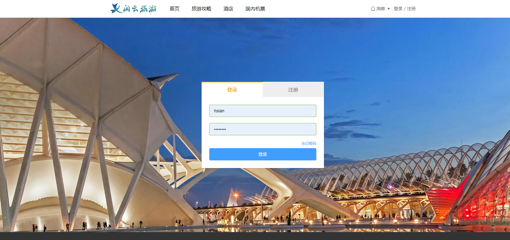
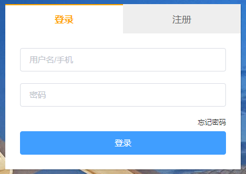
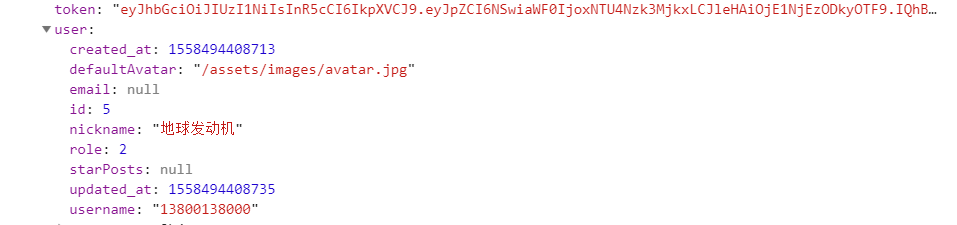

# 闲云旅游项目课程

# 第4章 登录注册

## 主要知识点

* 使用`vuex/store`管理数据
* 登录注册逻辑
* `Nuxt`的本地存储





## 登录注册页布局

替换`pages/user/login.vue`的代码如下

```vue
<template>
    <div class="container">
        <!-- 主要内容 -->
        <el-row 
        type="flex" 
        justify="center" 
        align="middle" 
        class="main">

            <div class="form-wrapper">
                <!-- 表单头部tab -->
                <el-row type="flex" justify="center" class="tabs">
                    <span :class="{active: currentTab === index}" 
                    v-for="(item, index) in [`登录`, `注册`]"
                    :key="index" 
                    @click="handleChangeTab(index)">
                        {{item}}
                    </span>
                </el-row>

                <!-- 登录功能组件 -->
                <!-- <LoginForm v-if="currentTab == 0"/> -->

                <!-- 注册功能组件 -->
                <!-- <RegisterForm v-if="currentTab == 1"/> -->
            </div>
        </el-row>
    </div>
</template>

<script>
export default {
    data(){
        return {
            currentTab: 0
        }
    },
    methods: {
        handleChangeTab(index){
            this.currentTab = index;
        },
    }
}
</script>

<style scoped lang="less">
.container{
    background:url(http://157.122.54.189:9095/assets/images/th03.jfif) center 0;
    height: 700px;
    min-width:1000px;

    .main{
        width:1000px;
        height: 100%;
        margin:0 auto;
        position: relative;
        
        .form-wrapper{
            width:400px;
            margin:0 auto;
            background:#fff;
            box-shadow: 2px 2px 0 rgba(0,0,0,0.1);
            overflow:hidden;
            
            .tabs{
                span{
                    display: block;
                    width:50%;
                    height: 50px;
                    box-sizing: border-box;
                    border-top:2px #eee solid;
                    background:#eee;
                    line-height: 48px;
                    text-align: center;
                    cursor: pointer;
                    color:#666;

                    &.active{
                        color:orange;
                        border-top-color: orange;
                        background:#fff;
                        font-weight: bold;
                    }
                }
            }
        }
    }
}
</style>

```

在预留的位置中将会导入登录组件和注册组件。


## 登录功能



### 思路

1. 在`components/user`中新建`loginForm.vue`表单组件
2. 使用`Element-ui`的表单组件
3. 表单数据绑定
4. 表单验证
5. 登录接口


### 实现步骤

#### 新建登录表单组件

在`components/user`中新建`loginForm.vue`组件，新增内容如下

```vue
<template>
    <el-form 
        :model="form" 
        ref="form"
        :rules="rules" 
        class="form">

        <el-form-item class="form-item">
            <el-input 
            placeholder="用户名/手机">
            </el-input>
        </el-form-item>

        <el-form-item class="form-item">
            <el-input 
            placeholder="密码" 
            type="password">
            </el-input>
        </el-form-item>

        <p class="form-text">
            <nuxt-link to="#">忘记密码</nuxt-link>
        </p>

        <el-button 
        class="submit"
        type="primary"
        @click="handleLoginSubmit">
            登录
        </el-button>
    </el-form>

</template>

<script>
export default {
    data(){
        return {
            // 表单数据
            form: {},
            // 表单规则
            rules: {},
        }
    },
    methods: {
        // 提交登录
        handleLoginSubmit(){
           console.log(this.form)
        }
    }
}
</script>

<style scoped lang="less">
    .form{
        padding:25px;
    }

    .form-item{
        margin-bottom:20px;
    }

    .form-text{
        font-size:12px;
        color:#409EFF;
        text-align: right;
        line-height: 1;
    }

    .submit{
        width:100%;
        margin-top:10px;
    }
</style>

```


> 注意：新增了组件后在`pages/user/login.vue`中导入即可，导入位置，去除下面部分的组件的注释

```vue
<!-- 登录功能组件 -->
<!-- <LoginForm v-if="currentTab == 0"/> -->
```


#### 表单数据绑定

修改`data`的`form`数据，然后使用`v-model`绑定到对应的表单字段。

编辑`components/user/loginForm.vue`

```js
// 其他代码...

data(){
    return {
        // 表单数据
        form: {
            username: "",   // 登录用户名/手机
            password: ""    // 登录密码
        },
        // 其他代码...
    }
},
    
// 其他代码...
```

使用`v-model`绑定到对应的表单字段

```vue
<!-- 其他代码... -->

<el-form-item class="form-item">
    <!-- 新增了v-model -->
    <el-input 
              placeholder="用户名/手机"
              v-model="form.username">
    </el-input>
</el-form-item>

<el-form-item class="form-item">
    <!-- 新增了v-model -->
    <el-input 
              placeholder="密码" 
              type="password"
              v-model="form.password">
    </el-input>
</el-form-item>

<!-- 其他代码... -->
```


#### 表单验证

双向数据绑定到`form`字段后，我们现在可以来提交表单了，但是提交之前还需要验证下表单字段是否合法，比如不能为空。

继续编辑`components/user/loginForm.vue`

```js
// 其他代码...

data(){
    return {
        // 其他代码...

        // 表单规则
        rules: {
            username: [
                { 
                    required: true, 
                    message: '请输入用户名', 
                    trigger: 'blur' 
                },
            ],
            password: [
                { 
                    required: true, 
                    message: '请输入密码', 
                    trigger: 'blur' 
                },
            ],
        },
    }
},
    
// 其他代码...
```

使用`el-form-item`添加`prop`属性

```vue
<!-- 其他代码... -->

<!-- 新增了prop属性 -->
<el-form-item class="form-item" prop="username">
    <el-input 
              placeholder="用户名/手机"
              v-model="form.username">
    </el-input>
</el-form-item>

<!-- 新增了prop属性 -->
<el-form-item class="form-item" prop="password">
    <el-input 
              placeholder="密码" 
              type="password"
              v-model="form.password">
    </el-input>
</el-form-item>

<!-- 其他代码... -->
```

> 现在可以尝试在把`input`输入框的值清空，会出现在`rules`中的定义的提示内容


#### 登录接口

接下来要调用登录的接口进行登录了，如果一切正常的话，我们可以看到后台返回的用户信息，如果登录失败，我们需要对统一对错误的返回进行处理，这个我们在最后再统一实现。

修改`components/user/loginForm.vue`的提交登录事件：

```js
// 其他代码...

// 提交登录
methods: {
    handleLoginSubmit(){
        // 验证表单
        this.$refs['form'].validate((valid) => {
            // 为true表示没有错误
            if (valid) {
                this.$axios({
                    url: "/accounts/login",
                    method: "POST",
                    data: this.form
                }).then(res => {
                    console.log(res.data);
                })
            }
        })
    }
}

// 其他代码...
```

> 现在登录接口可以开始访问了，服务器给我们提供了测试账号密码
>
> 账号：`13800138000`
>
> 密码：`123456`

如果正常登录应该可以在控制看到打印出来的用户信息，则表示登录成功了。




### 总结

1. 在`components/user`中新建`loginForm.vue`表单组件
2. 使用`Element-ui`的表单组件绑定数据和验证表单
3. 调用登录接口


## 使用store管理数据

### 思路

使用`vuex`统一管理用户登录注册行为和用户信息。

1. 在`store`文件夹新建`user.js`
2. 在`store/user.js`中实现登录，并保存数据到`store`的`state`中
3. 在头部组件中显示用户信息


### 实现步骤

#### 新建状态文件

在`store`文件夹新建`user.js`，并添加以下代码

```js
// 用户管理
export const state = () => ({
    // 采用接口返回的数据结构
    userInfo: {
        token: "",
        user: {},
    },
}) 

export const mutations = {};

export const actions = {};
```


#### 实现登录

把登录请求放到`store/user.js`中统一管理。

```js
// 其他代码..

export const mutations = {
    // 保存用户信息到state
    setUserInfo(state, data){
        state.userInfo = data;
    },
};

export const actions = {
    // 登录
    login({commit}, data){
        return this.$axios({
            url: "/accounts/login",
            method: "POST",
            data: data
        }).then(res => {
            const data = res.data;
            // 保存到state
            commit("setUserInfo", data);
            return data;
        })
    }
};
```

那么我们可以把`components/user/loginForm`中的登录事件替换成下面这样了

```js
// 其他代码...

methods: {
    // 提交登录
    handleLoginSubmit(){
        // 验证表单
        this.$refs['form'].validate((valid) => {
            // 为true表示没有错误
            if (valid) {
                // 删除代码
                // this.$axios({
                //     url: "/accounts/login",
                //     method: "POST",
                //     data: this.form
                // }).then(res => {
                //     console.log(res.data);
                // })
				
                // 新增代码
                this.$store.dispatch("user/login", this.form).then(res => {
                    // 成功提示
                    this.$message({
                        message: "登录成功，正在跳转",
                        type: "success"
                    });
                    // 跳转到首页
                    setTimeout(() => {
                        this.$router.replace("/")
                    }, 1000);
                })
            }
        })
    }
}

// 其他代码...
```


#### 展示用户信息

在头部组件展示`store`中保存的用户数据。

在`components/header.vue`中实现该功能：

```vue
<!-- 其他代码... -->

<!-- 如果用户存在则展示用户信息，用户数据来自store -->
<el-dropdown v-if="$store.state.user.userInfo.token">
    <el-row type="flex" align="middle" class="el-dropdown-link">
        <nuxt-link to="#">
            
            {{$store.state.user.userInfo.user.nickname}} 
        </nuxt-link>
        <i class="el-icon-caret-bottom el-icon--right"></i>
    </el-row>
    <!-- 其他代码... -->
</el-dropdown>

<!-- 其他代码... -->
```

> 再模板中使用`$store.state.user.userInfo`可以访问`store`的数据，虽然长了点，但是不难理解。

> 注册功能也是同样的优化思路


## 保存`store`到本地

现在用户已经保存到`store`了，但是还有一个问题，数据是保存在缓存中的，如果页面一刷新，那么数据就会不见了，这样是不合理的。

所以我们需要使用`localStorage`把数据保存到本地，但是由于`nuxtjs`是运行在服务器的，不能直接在`store`中使用浏览器的方法，所以我们需要依赖一些判断和插件。

### 思路

1. 保存用户信息到本地


### 实现步骤


#### 保存用户信息到本地

`nuxtjs`中`store`不能直接在浏览器的`lcoalStorage`方法，所以我们需要依赖一个插件`vuex-persistedstate`，该插件会把本地存储的数据读取到`store`。

> 插件地址：<https://github.com/robinvdvleuten/vuex-persistedstate>

1. 安装插件

```
npm install --save vuex-persistedstate
```

2. 在根目录`plugins`中新建文件`localStorage.js`，加入以下代码

```js
import createPersistedState from 'vuex-persistedstate'

export default ({store}) => {
    window.onNuxtReady(() => {
        createPersistedState({
            key: "store", // 读取本地存储的数据到store
        })(store)
    })
}
```

3. 导入插件

修改`nuxt.config.js`配置文件，在`plugins`配置项中新增一条数据

```js
// 其他代码...

plugins: [
    // 其他代码...
    { src: '@/plugins/localStorage', ssr: false }
],
      
// 其他代码...
```

> 修改完后重新启动项目即可。


### 总结

1. 使用`vuex-persistedstate`保存到本地存储


## 退出登录


### 思路

退出功能只需要清除`store`和本地的用户信息即可。

1. 新增清除方法
2. 调用清除方法


### 实例步骤

#### 新增清除方法

在store/user.js`的`mutations`添加清除方法

```js
// 其他代码...

export const mutations = {
    // 其他代码...
    
    // 清除用户数据
    cleanUserInfo(state, info){
        if(process.browser){
            localStorage.removeItem("userInfo");
        }
        state.userInfo = {};
    }
};

// 其他代码...
```


#### 调用清除方法

修改`components/header.vue`的退出登录事件方法：

```js
// 其他代码...

export default {
    methods: {
        // 用户退出
        handleLogout(){
            const {commit} = this.$store;
            commit("user/cleanUserInfo");
            
            this.$message({
                message: "退出成功",
                type: "success"
            })
        },
    }
}

// 其他代码...
```


## 注册功能


### 思路

1. 在`components/user`中新建`register.vue`表单组件
2. 使用`Element-ui`的表单组件
3. 表单数据绑定
4. 表单验证
5. 发送手机验证码
6. 注册接口


### 实现步骤

#### 新建注册表单组件

在`components/user`中新建`RegisterForm.vue`组件，新增内容如下

```vue
<template>
    <el-form 
        :model="form" 
        ref="form" 
        :rules="rules" 
        class="form">
            <el-form-item class="form-item">
                <el-input 
                placeholder="用户名手机">
                </el-input>
            </el-form-item>

            <el-form-item class="form-item">
                <el-input 
                placeholder="验证码" >
                    <template slot="append">
                        <el-button @click="handleSendCaptcha">
                            发送验证码
                        </el-button>
                    </template>
                </el-input>
            </el-form-item>

            <el-form-item class="form-item">
                <el-input 
                placeholder="你的名字">
                </el-input>
            </el-form-item>

            <el-form-item class="form-item">
                <el-input 
                placeholder="密码" 
                type="password"
                ></el-input>
            </el-form-item>

            <el-form-item class="form-item">
                <el-input 
                placeholder="确认密码" 
                type="password">
                </el-input>
            </el-form-item>

            <el-button 
            class="submit" 
            type="primary" 
            @click="handleRegSubmit">
                注册
            </el-button>
        </el-form>
</template>

<script>
export default {
    data(){
        return {
            // 表单数据
            form: {},
            // 表单规则
            rules: {},
        }
    },
    methods: {
        // 发送验证码
        handleSendCaptcha(){

        },


        // 注册
        handleRegSubmit(){
           console.log(this.form)
        }
    }
}
</script>

<style scoped lang="less">
    .form{
        padding:25px;
    }

    .form-item{
        margin-bottom:20px;
    }

    .form-text{
        font-size:12px;
        color:#409EFF;
        text-align: right;
        line-height: 1;
    }

    .submit{
        width:100%;
        margin-top:10px;
    }
</style>
```

>
>
> 注意：新增了组件后在`pages/user/login.vue`中导入即可，导入位置，去除下面部分的组件的注释

```vue
<!-- 注册功能组件 -->
<!-- <RegisterForm v-if="currentTab == 1"/> -->
```


#### 表单数据绑定

修改`data`的`form`数据，然后使用`v-model`绑定到对应的表单字段。

编辑`components/user/RegisterForm.vue`

```js
// 其他代码...

data(){
    return {
        // 表单数据
        form: {
            username: "",   // 登录用户名/手机
            password: ""    // 登录密码
            checkPassword: "", // 确认密码
            nickname: "",	// 昵称
            captcha: ""		// 手机验证码
        },
        // 其他代码...
    }
},
    
// 其他代码...
```

使用`v-model`绑定到对应的表单字段

```vue
<!-- 其他代码... -->

			<el-form-item class="form-item">
                <el-input 
                placeholder="用户名手机"
                v-model="form.username">
                </el-input>
            </el-form-item>

            <el-form-item class="form-item">
                <el-input 
                placeholder="验证码"
                v-model="form.captcha" >
                    <template slot="append">
                        <el-button @click="handleSendCaptcha">
                            发送验证码
                        </el-button>
                    </template>
                </el-input>
            </el-form-item>

            <el-form-item class="form-item">
                <el-input 
                placeholder="你的名字"
                v-model="form.nickname">
                </el-input>
            </el-form-item>

            <el-form-item class="form-item">
                <el-input 
                placeholder="密码" 
                type="password"
                v-model="form.password"
                ></el-input>
            </el-form-item>

            <el-form-item class="form-item">
                <el-input 
                placeholder="确认密码" 
                type="password"
                v-model="form.checkPassword">
                </el-input>
            </el-form-item>

<!-- 其他代码... -->
```


#### 表单验证

双向数据绑定到`form`字段后，我们现在可以来提交表单了，但是提交之前还需要验证下表单字段是否合法，比如不能为空。

继续编辑`components/user/RegisterForm.vue`

```js
// 其他代码...

data(){
    // 确认密码
    const validatePass = (rule, value, callback) => {
        if (value === '') {
            callback(new Error('请再次输入密码'));
        } else if (value !== this.form.password) {
            callback(new Error('两次输入密码不一致!'));
        } else {
            callback();
        }
    }
    
    return {
        // 其他代码...

        // 表单规则
        rules: {
            username: [{ 
                required: true, 
                message: '请输入用户名', 
                trigger: 'blur' 
            }],
            password: [{ 
                required: true, 
                message: '请输入密码', 
                trigger: 'blur' 
            }],
            checkPassword: [{ 
                validator: validatePass, 
                trigger: 'blur' 
            }],
            nickname: [{ 
                required: true, 
                message: '请输入昵称', 
                trigger: 'blur' 
            }],
            captcha: [{ 
                required: true, 
                message: '请输入验证码', 
                trigger: 'blur' 
            }],
        },
    }
},
    
// 其他代码...
```

> 和登录组件一样，给`el-form-item`添加对应的`prop`属性。


#### 发送手机验证码

根据手机号码发送手机验证码，默认返回`6`个`0`。

`components/user/RegisterForm.vue`

```js
// 发送验证码
handleSendCaptcha(){
    if(!this.form.username){
        this.$confirm('手机号码不能为空', '提示', {
            confirmButtonText: '确定',
            showCancelButton: false,
            type: 'warning'
        })
        return;
    }

    if(this.form.username.length !== 11){
        this.$confirm('手机号码格式错误', '提示', {
            confirmButtonText: '确定',
            showCancelButton: false,
            type: 'warning'
        })
        return;
    }


    this.$axios({
        url: `captchas`,
        method: "POST",
        data: {
            tel: this.form.username
        }
    }).then(res => {
        const {code} = res.data;
        this.$confirm(`模拟手机验证码为：${code}`, '提示', {
            confirmButtonText: '确定',
            showCancelButton: false,
            type: 'warning'
        })
    })
},
```


#### 注册接口

提交数据到注册接口，返回数据和登录接口是一样的。

`components/user/RegisterForm.vue`

```js
// 注册
handleRegSubmit(){
    this.$refs['form'].validate((valid) => {
        if (valid) {
            // 注册提交
            const {checkPassword, ...props} = this.regForm;

            this.$axios({
                url: `/accounts/register`,
                method: "POST",
                data: props
            }).then(res => {
                console.log(res.data);
            })
        } 
    });
},
```


### 总结

注册和登录的步骤大致上是一样的，只是接口和参数的区别，尝试把注册的提交事件和登录一样提取到`store/user.js`的`actions`下。

