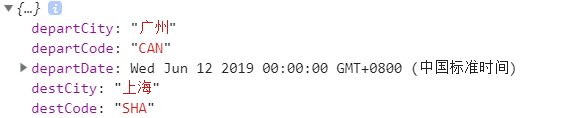

# 闲云旅游项目课程

# 错误拦截`!`

使用`axios`的拦截器拦截页面的**所有请求错误**，并弹出对应的提示。

## 新建拦截插件

新建文件`plugins/axios.js`，添加以下内容

```js
import {Message} from "element-ui";

export default function({$axios, redirect}){
    $axios.onError(err => {
        const {statusCode, message} = err.response.data;
        
        // 还未使用
        // if(statusCode === 401 || statusCode === 403){
        //     Message.warning({message: "请先登录"});
        //     redirect("/user/login");
        // }

        if(statusCode === 400){
            Message.warning({message});
        }
    })
}
```


## 调用插件

`nuxt.config.js`

```js
// 其他代码...

plugins: [
    '@/plugins/element-ui',
    { src: '@/plugins/localStorage', ssr: false },
    '@/plugins/axios' // 调用插件
],
    
// 其他代码...
```


# 机票首页

## 重要知识点

* 机票搜索的业务逻辑
* momentjs的使用


## 机票首页布局

替换`pages/air/index.vue`的代码如下

```vue
<template>
  <section class="container">
    <h2 class="air-title"><span class="iconfont iconfeiji"></span>
      <i>国内机票</i>
    </h2>

    <!-- 搜索广告栏 -->
    <el-row type="flex" justify="space-between">
        <!-- 搜索表单 -->
        <div>搜索</div>

        <!-- banner广告 -->
        <div class="sale-banner">
            
        </div>
    </el-row>

    <!-- 广告 -->
    <el-row type="flex" class="statement">
      <el-col :span="8">
        <i class="iconfont iconweibiaoti-_huabanfuben" style="color:#409EFF;"></i>
        <span>100%航协认证</span>
      </el-col>
      <el-col :span="8">
        <i class="iconfont iconbaozheng" style="color:green;"></i>
        <span>出行保证</span>
      </el-col>
      <el-col :span="8">
        <i class="iconfont icondianhua" style="color:#409EFF;"></i>
        <span>7x24小时服务</span>
      </el-col>
    </el-row>

    <h2 class="air-sale-title">
      <span class="iconfont icontejiajipiao"></span>
      <i>特价机票</i>
    </h2>

    <!-- 特价机票 -->
    <div class="air-sale">
        
    </div>
  </section>
</template>

<script>
export default {

}
</script>

<style scoped lang="less">
.air-sale{
  border: 1px #ddd solid;
  padding:20px;
  margin-bottom:50px;

  .air-sale-pic{
    > div{
      width:225px;
      height:140px;
      position: relative;
      overflow: hidden;

      img{
        width:100%;
      }

      .layer-bar{
        position:absolute;
        bottom:0;
        left:0;
        background: rgba(0,0,0,0.5);
        color:#fff;
        height:30px;
        line-height: 30px;
        width:100%;
        box-sizing: border-box;
        padding: 0 15px;
        font-size: 14px;

        span:last-child{
          font-size:18px;
        }
      }
    }
  }
}

.air-sale-group{
  margin-top:20px;
  padding-top:8px;
  border-right:1px #eee solid;

  &:last-child{
    border-right:none;
  }

  .air-sale-row{
    font-size:12px;
    color:#666;
    margin-bottom:8px;

    .air-sale-price{
      color:orange;
      font-size: 20px;
    }
  }
}

.container{
  width:1000px;
  margin:0 auto;
}

.air-title{
  margin:15px 0;
  font-size:20px;
  font-weight: normal;
  color:orange;

  span{
    font-size:20px;
  }
}

.statement{
  margin:15px 0;
  border:1px #ddd solid;
  background:#f5f5f5;
  height: 58px;
  padding:10px 0;
  box-sizing:border-box;

  > div{
    text-align: center;
    line-height: 38px;
    border-right:1px #ddd solid;

    &:last-child{
      border-right: none;
    }

    *{
      vertical-align: middle;
    }

    i{
      font-size:30px;
    }
  }
}

.air-sale-title{
  margin:15px 0;
  font-size:20px;
  font-weight: normal;
  color:#409EFF;

  span{
    font-size:20px;
  }
}
</style>
```

在上面布局中继续完善机票搜索功能和特价机票列表。


## 封装搜索组件

​	机票搜索表单的交互比较多，而且功能比较独立，所以封装成组件导入，后面我们会更多的模块封装成组件。

### 组件布局

新建机票搜索表单组件`components/air/searchForm.vue`，并替换以下布局代码

```vue
<template>
    <div class="search-form">

        <!-- 头部tab切换 -->
        <el-row type="flex" class="search-tab">
            <span v-for="(item, index) in tabs" :key="index"
            @click="handleSearchTab(item, index)"
            :class="{active: index === currentTab}">
                <i :class="item.icon"></i>{{item.name}}
            </span>
        </el-row>

        <el-form class="search-form-content" ref="form" label-width="80px">
            <el-form-item label="出发城市">
                <!-- fetch-suggestions 返回输入建议的方法 -->
                <!-- select 点击选中建议项时触发 -->
                <el-autocomplete
                :fetch-suggestions="queryDepartSearch"
                placeholder="请搜索出发城市"
                @select="handleDepartSelect"
                class="el-autocomplete"
                ></el-autocomplete>
            </el-form-item>
            <el-form-item label="到达城市">
                <el-autocomplete
                :fetch-suggestions="queryDestSearch"
                placeholder="请搜索到达城市"
                @select="handleDestSelect"
                class="el-autocomplete"
                ></el-autocomplete>
            </el-form-item>
            <el-form-item label="出发时间">
                <!-- change 用户确认选择日期时触发 -->
                <el-date-picker type="date" 
                placeholder="请选择日期" 
                style="width: 100%;"
                @change="handleDate">
                </el-date-picker>
            </el-form-item>
            <el-form-item label="">
                <el-button style="width:100%;" 
                type="primary" 
                icon="el-icon-search"
                @click="handleSubmit">
                    搜索
                </el-button>
            </el-form-item>
            <div class="reverse">
                <span @click="handleReverse">换</span>
            </div>
        </el-form>  
      </div>
</template>

<script>
export default {
    data(){
        return {
            tabs: [
                {icon: "iconfont icondancheng", name: "单程"},
                {icon: "iconfont iconshuangxiang", name: "往返"}
            ],
            currentTab: 0,
        }
    },
    methods: {
        // tab切换时触发
        handleSearchTab(item, index){
            
        },
        
        // 出发城市输入框获得焦点时触发
        // value 是选中的值，cb是回调函数，接收要展示的列表
        queryDepartSearch(value, cb){
            cb([
                {value: 1},
                {value: 2},
                {value: 3},
            ]);
        },

        // 目标城市输入框获得焦点时触发
        // value 是选中的值，cb是回调函数，接收要展示的列表
        queryDestSearch(value, cb){
            cb([
                {value: 1},
                {value: 2},
                {value: 3},
            ]);
        },
       
        // 出发城市下拉选择时触发
        handleDepartSelect(item) {
            
        },

        // 目标城市下拉选择时触发
        handleDestSelect(item) {
            
        },

        // 确认选择日期时触发
        handleDate(value){
           
        },

        // 触发和目标城市切换时触发
        handleReverse(){
            
        },

        // 提交表单是触发
        handleSubmit(){
           
        }
    },
    mounted() {
       
    }
}
</script>

<style scoped lang="less">
.search-form{
    border:1px #ddd solid;
    border-top:none;
    width:360px;
    height:350px;
    box-sizing: border-box;
}

.search-tab{
  span{
    display: block;
    flex:1;
    text-align: center;
    height:48px;
    line-height: 42px;
    box-sizing: border-box;
    border-top:3px #eee solid;
    background:#eee;
  }

  .active{
    border-top-color: orange;
    background:#fff;
  }

  i{
    margin-right:5px;
    font-size: 18px;

    &:first-child{
      font-size:16px;
    }
  }
}

.search-form-content{
  padding:15px 50px 15px 15px;
  position: relative;

  .el-autocomplete{
    width: 100%;
  }
}

.reverse{
  position:absolute;
  top: 35px;
  right:15px;

  &:after,&:before{
      display: block;
      content: "";
      position: absolute;
      left:-35px;
      width:25px;
      height:1px;
      background:#ccc;
  }

  &:after{
      top:0;
    }

    &:before{
      top:60px;
    }

  span{
    display: block;
    position:absolute;
    top: 20px;
    right:0;
    font-size:12px;
    background: #999;
    color:#fff;
    width:20px;
    height:20px;
    line-height: 18px;
    text-align: center;
    border-radius: 2px;
    cursor: pointer;

    &:after,&:before{
      display: block;
      content: "";
      position: absolute;
      left:10px;
      width:1px;
      height:20px;
      background:#ccc;
    }

    &:after{
      top:-20px;
    }

    &:before{
      top:20px;
    }
  }
}
</style>

```

创建完成后在`pages/air/index.vue`中导入组件

```vue
<template>
<!-- 其他代码... -->

    <!-- 搜索广告栏 -->
    <el-row type="flex" justify="space-between">
        <!-- 搜索表单 -->
        <SearchForm/>

        <!-- banner广告 -->
    </el-row>

<!-- 其他代码... -->
</template>
<script>
import SearchForm from "@/components/air/searchForm";

export default {
    components: {
        SearchForm
    },
}
</script>
```


### 相关组件介绍

1.`el-autocomplete`远程搜索组件

组件文档：<https://element.eleme.cn/#/zh-CN/component/input#yuan-cheng-sou-suo>

2.`el-date-picker`日期选择组件

组件文档：<https://element.eleme.cn/#/zh-CN/component/date-picker#xuan-ze-ri>


## 搜索功能

### 思路

1. 搜索分析
2. 获取出发城市和到达的数据
3. 下拉数据列表选择选项时候赋值
4. 搜索跳转/ 自定义验证
5. 出发城市和到达城市切换
6. 往返


### 实现步骤

以下代码都在`components/air/searchForm.vue`中编辑。


####  搜索分析`!`

从结果出发，首先来看下我看点击表单后会发生什么事？


点击表单的搜索按钮后会跳转到该页面，并且**提供了`5`个用于查询的参数**，暂且不考虑目前有没该页面，我们可以先考虑如何给页面提供这些参数。


**参数列表`（重要）`：**

* `departCity` 出发城市（注意没有`市`字）
* `departCode` 出发城市代码
* `destCity` 到达城市（注意没有`市`字）
* `destCode` 到达城市代码
* `departDate` 出发日期


我们可以从查找机票城市的接口找到城市相关数据，在用户输入城市的同时获得上面的数据。

接口：

```
/airs/city
```

返回：

```js
{
  data: [{
    code: "440100000000",
    created_at: "2019-04-02 08:18:16",
    id: 197,
    level: "2",
    name: "广州市",
    parentCode: "440000000000",
    sort: "CAN",
    updated_at: 1558617184703
  }];
  total: 1
}
```


#### 获取城市数据


**1.在data中新增变量存储表单数据**

在data中定义需要提交的是`5`个参数

```vue
<script>
export default {
    data(){
        return {
            // 其他代码...
            form: {
                departCity: "", // 出发城市
                departCode: "", // 出发城市代码
                destCity: "",  // 到达城市
                destCode: "",  // 到达城市代码
                departDate: "", // 日期字符串
            },
        }
    },
}
</script>
```

注意在`template`的表单中使用`v-model`双向绑定数据到`form`的属性。

比如出发城市`v-model="form.departCity"`：

```vue
<el-autocomplete
                :fetch-suggestions="queryDepartSearch"
                placeholder="请搜索出发城市"
                @select="handleDepartSelect"
                class="el-autocomplete"
                v-model="form.departCity"
                ></el-autocomplete>
```


**2.调用城市查询接口**

使用实时查询的方式调用查询城市的接口，由于出发城市和到达城市都需要调用这个查询接口，所以把查询操作封装到一个独立函数来调用。

```vue
<script>
export default {
	// 其他代码...

    methods: {
        // 出发城市输入框获得焦点时触发
        // value 是选中的值，cb是回调函数，接收要展示的列表
        async queryDepartSearch(value, cb){
            const arr =  await this.querySearchAsync(value)
            if(arr.length > 0){
                // 不在下拉列表中选择，则默认选择第一项
                this.form.departCity = arr[0].value;
                this.form.departCode = arr[0].sort;
            }
            cb(arr)
        },

        // 目标城市输入框获得焦点时触发
        // value 是选中的值，cb是回调函数，接收要展示的列表
        async queryDestSearch(value, cb){
            const arr =  await this.querySearchAsync(value)
            if(arr.length > 0){
                // 不在下拉列表中选择，则默认选择第一项
                this.form.destCity = arr[0].value;
                this.form.destCode = arr[0].sort;
            }
            cb(arr)
        },

        // 查询城市接口的方法，返回promise
        // queryString是查询关键字
        querySearchAsync(queryString) {
            return new Promise((resolve, reject) => {
                // 如果关键字是空，则直接返回
                if(!queryString){
                    return resolve([]);
                }

                this.$axios({
                    url: `/airs/city`,
                    params: {
                        name: queryString
                    }
                }).then(res => {
                    const {data} = res.data;

                    // 下拉提示列表必须要有value字段
                    const arr = data.map(v => {
                        return {
                            ...v,
                            value: v.name.replace("市", "")
                        }
                    });
                    resolve(arr);
                });
            });
        },
        
        // 其他代码...
    }

}
</script>
```


**3.测试城市数据**

接下来我们测试下城市数据，为了查看查询结果，我们在提交方法中打印下表单数据

```js
// 提交表单是触发
handleSubmit(){
    console.log(this.form)
}
```

输入： 广州 到 上海


点击搜索查看打印信息




> 日期`departDate`只需要在`el-date-picker`组件中使用`v-model="form.departDate"`进行绑定即可获得了。

目前为止，我们可以获取到`5`个参数了，但是日期的格式好像有点问题，不过不着急，我们一个个问题来解决。


#### 下拉数据选中赋值

针对城市下拉框选项选中的事件处理，我们应该把`选中的选项`当做是当前的数据

```vue
<script>
    export default {
        // 其他代码...
        
        methods: {
            // 其他代码...
            
            // 出发城市下拉选择时触发
            // item代表当前选中项
            handleDepartSelect(item) {
                this.form.departCity = item.value;
                this.form.departCode = item.sort;
            },

            // 目标城市下拉选择时触发
            // item代表当前选中项
            handleDestSelect(item) {
                this.form.destCity = item.value;
                this.form.destCode = item.sort;
            },

            // 确认选择日期时触发
            handleDate(value){
               this.form.departDate = moment(value).format("YYYY-MM-DD");
            },
            
            // 其他代码...
        }
    }
</script>
```

注意上面代码中我们使用了`momentjs`，这是一个第三方的包，需要先下载并且导入。

下载命令：

```
npm install --save moment
```

在组件中引入

```js
import moment from "moment";
```

可以重复测试表单数据，会发现`5`个参数都没问题了


####  搜索跳转

下面来实现页面跳转，需要在`URL`中把`5`个参数都到带过去给搜索结果页`/air/flights`

```vue
<script>
    export default {
        // 其他代码...

        methods: {
            // 其他代码...

            // 提交表单是触发
            handleSubmit(){
                // 表单验证数据
                const rules = {
                    depart: {
                        value: this.form.departCity, 
                        message: "请选择出发城市"
                    },
                    dest: {
                        value: this.form.destCity, 
                        message: "请选择到达城市"
                    },
                    departDate: {
                        value: this.form.departDate, 
                        message: "请选择出发时间"
                    },
                }

                let valid = true; // 表单验证结果

                Object.keys(rules).forEach(v => {
                    // 只要有一个结果不通过，就停止循环
                    if(!valid) return;
                    const item = rules[v];

                    // 数据字段为空
                    if(!item.value){
                        valid = false;

                        this.$confirm(item.message, '提示', {
                            confirmButtonText: '确定',
                            showCancelButton: false,
                            type: 'warning'
                        })
                    }
                });

                // 不通过验证，不需要往下执行
                if(!valid) return;

                this.$router.push({
                    path: "/air/flights",
                    query: this.form
                })
            }
        }
    }
</script>
```

> `/air/flights`页面暂时还没创建，不过只要能从`URL`中看到参数正确传递即可。


####  城市切换

这是个把出发城市和到达城市对换位置的功能，实现起来非常简单，把`form`的数据对调换就可以了


调换的事件函数

```vue
<script>
    export default {
        // 其他代码...
        
        methods: {
            // 其他代码...
            
            // 触发和目标城市切换时触发
            handleReverse(){
                const { departCity, departCode, destCity, destCode} = this.form;

                this.form.departCity = destCity;
                this.form.departCode = destCode;
                this.form.destCity = departCity;
                this.form.destCode = departCode;
            },
        }
    }
</script>
```


#### 往返

目前接口不支持往返，需要添加一个提示

````js
// tab切换时触发
handleSearchTab(item, index){
    if(index === 1){
        this.$confirm("目前暂不支持往返，请使用单程选票！", '提示', {
            confirmButtonText: '确定',
            showCancelButton: false,
            type: 'warning'
        })
    }
},
````


### 总结

1. 关键点在于如何获取跳转链接需要的`5`个参数`！`
2. `el-autocomplete`组件的使用（查看文档）
3. 使用`momentjs`进行时间转换
4. 表单自定义验证


## 特价机票

### 思路

1. 特价机票布局
2. 请求数据接口


### 实现步骤

#### 特价机票布局

新增特价机票布局和模拟数据。

`pages/air/index.vue`

```vue
<template>
  <section class="container">
    <!-- 其他代码... -->

    <!-- 特价机票 -->
    <div class="air-sale">
        <el-row type="flex" class="air-sale-pic" justify="space-between">
            <el-col :span="6" v-for="(item, index) in sales" :key="index">
                <nuxt-link :to="`/air/flights?departCity=${item.departCity}&departCode=${item.departCode}&destCity=${item.destCity}&destCode=${item.destCode}&departDate=${item.departDate}`">
                    
                    <el-row class="layer-bar" type="flex" justify="space-between">
                        <span>{{item.departCity}}-{{item.destCity}}</span>
                        <span>￥699</span>
                    </el-row>
                </nuxt-link>
            </el-col>
        </el-row>
    </div>
  </section>
</template>

<script>
// 其他代码...
export default {
    data(){
        return {
            sales: [{
                cover: "https://gss0.bdstatic.com/94o3dSag_xI4khGkpoWK1HF6hhy/baike/s%3D220/sign=9154c841bcfd5266a32b3b169b199799/3812b31bb051f8199687c7e0d0b44aed2f73e7fe.jpg",
                departCity: "广州",
                departCode: "CAN",
                departDate: "2019-06-17",
                destCity: "上海",
                destCode: "SHA",
                price: 760
            }]
        }
    },
    
    // 其他代码...
}
</script>

```

> 注意跳转链接的`nuxt-link :to="/air/flights?xxxx`的参数拼接
>

#### 请求数据接口

```vue
<script>
import SearchForm from "@/components/air/searchForm";

export default {
    data(){
        return {
            sales: [] // 去除模拟数据
        }
    },
    mounted(){
        this.$axios({
            url: `/airs/sale`
        }).then(res => {
            this.sales = res.data.data;
        });
    },

	// 其他代码...
}
</script>
```


