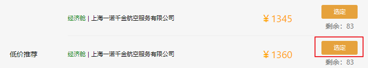

# 闲云旅游项目课程

# 机票列表页

## 重要知识点

* 页面渲染
* 搜索条件过滤
* 本地存储搜索记录


## 基本布局

新建机票列表页`pages/air/flights.vue`，代码如下

```vue
<template>
    <section class="contianer">
        <el-row  type="flex" justify="space-between">

            <!-- 顶部过滤列表 -->
            <div class="flights-content">
                <!-- 过滤条件 -->
                <div>
                    
                </div>
                
                <!-- 航班头部布局 -->
                <div>
                    
                </div>
                
                
                <!-- 航班信息 -->
                <div>
                    
                </div>
            </div>

            <!-- 侧边栏 -->
            <div class="aside">
                <!-- 侧边栏组件 -->
            </div>
        </el-row>
    </section>
</template>

<script>

import moment from "moment";

export default {
    data(){
        return {
            
        }
    }
}
</script>

<style scoped lang="less">
    .contianer{
        width:1000px;
        margin:20px auto;
    }

    .flights-content{
        width:745px;
        font-size:14px;
    }

    .aside{
        width:240px;
    } 
</style>
```


## 航班列表

### 思路

1. 列表头部组件

2. 列表组件布局

3. 无数据提示


### 实现步骤

#### 列表头部组件

预览效果：


1.新建列表头部组件`components/air/flightsListHead.vue`，并添加以下内容：

```vue
<template>
    <el-row class="flight-title">
        <el-col :span="5">
            航空信息
        </el-col>
        <el-col :span="14">
            <el-row type="flex" justify="space-between">
                <el-col :span="12">
                    起飞时间
                </el-col>
                <el-col :span="12">
                    到达时间
                </el-col>
            </el-row>
        </el-col>
        <el-col :span="5">
            价格
        </el-col>
    </el-row>
</template>

<script>
export default {

}
</script>

<style scoped lang="less">
    .flight-title{
        padding:0 15px;
        border:1px #ddd solid;
        background:#f6f6f6;
        height:38px;
        line-height: 38px;
        color:#666;
        font-size:12px;
        margin-bottom: 10px;

        > div{
            text-align: center
        }
    }
</style>
```


2.在`pages/air/fights.vue`中引入组件

```vue
<template>
    <section class="contianer">
        <el-row  type="flex" justify="space-between">
            <!-- 顶部过滤列表 -->
            <div class="flights-content">
                <!-- 其他代码.. -->
                
                
                <!-- 航班头部布局 -->
                <FlightsListHead/>
                
                
                <!--  其他代码... -->  
            </div>
			
            <!--  其他代码... -->
        </el-row>
    </section>
</template>

<script>
import FlightsListHead from "@/components/air/flightsListHead.vue"

export default {
    // 其他代码...

    components: {
        FlightsListHead
    }
}
</script>
```


#### 机票列表组件

预览效果：


1.新建机票列表组件`components/air/flightsItem.vue`，并添加以下内容：

```vue
<template>
    <div class="flight-item">
        <div>
            <!-- 显示的机票信息 -->
            <el-row type="flex" align="middle" class="flight-info">
                <el-col :span="6">
                    <span>东航 </span> MU5316
                </el-col>
                <el-col :span="12">
                    <el-row type="flex" justify="space-between" class="flight-info-center">
                        <el-col :span="8" class="flight-airport">
                            <strong>20:30</strong>
                            <span>白云机场T1</span>
                        </el-col>
                        <el-col :span="8" class="flight-time">
                            <span>2时20分</span>
                        </el-col>
                        <el-col :span="8" class="flight-airport">
                            <strong>22:50</strong>
                            <span>虹桥机场T2</span>
                        </el-col>
                    </el-row>
                </el-col>
                <el-col :span="6" class="flight-info-right">
                    ￥<span class="sell-price">810</span>起
                </el-col>
            </el-row>
        </div>
        <div class="flight-recommend">
            <!-- 隐藏的座位信息列表 -->
            <el-row type="flex"  justify="space-between" align="middle">
                <el-col :span="4">低价推荐</el-col>
                <el-col :span="20">
                    <el-row type="flex" justify="space-between" align="middle" class="flight-sell">
                        <el-col :span="16" class="flight-sell-left">
                            <span>经济舱</span> | 上海一诺千金航空服务有限公司
                        </el-col>
                        <el-col :span="5" class="price">
                            ￥1345
                        </el-col>
                        <el-col :span="3" class="choose-button">
                            <el-button 
                            type="warning" 
                            size="mini">
                            选定
                            </el-button>
                            <p>剩余：83</p>
                        </el-col>
                    </el-row>
                </el-col>
            </el-row>
        </div>
    </div>
</template>

<script>
export default {

    props: {
        // 数据
        data: {
            type: Object,
            // 默认是空数组
            default: {}
        }
    }
}
</script>

<style scoped lang="less">
    .flight-item{
        border:1px #ddd solid;
        margin-bottom: 10px;

        .flight-info{
            padding:15px;
            cursor: pointer;

            > div{
                &:first-child, &:last-child{
                    text-align: center;
                }
            }
        }

        .flight-info-center{
            padding:0 30px;
            text-align: center;

            .flight-airport{
                strong{
                    display: block;
                    font-size:24px;
                    font-weight: normal;
                }
                span{
                    font-size: 12px;
                    color:#999;
                }
            }

            .flight-time{
                span{
                    display: inline-block;
                    padding:10px 0;
                    border-bottom: 1px #eee solid;
                    color:#999;
                }
            }
        }

        .flight-info-right{
            
            .sell-price{
                font-size: 24px;
                color:orange;
                margin:0 2px;
            }
        }
    }

    .flight-recommend{
        background: #f6f6f6;
        border-top:1px #eee solid;
        padding:0 20px;

        .flight-sell{
            border-bottom:1px #eee solid;
            padding:10px 0;

            &:last-child{
                border-bottom: none;
            }

            .flight-sell-left{
                font-size: 12px;
                span{
                    color:green;
                }
            } 

            .price{
                font-size: 20px;
                color:orange;
            }

            .choose-button{
                text-align: center;
                color:#666;
                button{
                    display: block;
                    width:100%;
                    margin-bottom:5px;
                }
            }
        }
    }
</style>
```

组件接收一个名为`data`的机票数据，但是目前还没请求后台接口，所以预留到后面再使用。


2.在`pages/air/fights.vue`中引入组件

```vue
<template>
    <section class="contianer">
        <el-row  type="flex" justify="space-between">

            <!-- 顶部过滤列表 -->
            <div class="flights-content">
                <!-- 其他代码 -->

                <!-- 航班信息 -->
                <div>
                    <!-- 航班列表 -->
                    <FlightsItem/>

                </div>
            </div>

            <!-- 其他代码... -->
        </el-row>
    </section>
</template>

<script>
import FlightsListHead from "@/components/air/flightsListHead.vue";
import FlightsItem from "@/components/air/flightsItem.vue"

export default {
    data(){
        return {
            
        }
    },

    components: {
        FlightsListHead,
        FlightsItem
    }
}
</script>
```


## 航班列表渲染


### 思路

1. 渲染列表数据
2. 计算相差时间
3. 控制列表展开
4. 分页


### 实现步骤

#### 渲染列表数据

**1.请求接口数据**

`pages/air/flights.vue`

```vue
<template>
    <section class="contianer">
       <!-- 其他代码... -->
                
                <!-- 航班信息 -->
                <div>
                    <!-- 航班列表 -->
                    <flightsItem 
                    v-for="(item, index) in dataList" 
                    :key="index" 
                    :data="item"/>

                </div>
         <!-- 其他代码... -->   
    </section>
</template>
<script>
// 其他代码...
export default {
    data(){
        return {
            flightsData: {}, // 航班总数据
            dataList: []     // 航班列表数据，用于循环flightsItem组件，单独出来是因为要分页
        }
    },

 	// 其他代码...

    methods: {
        // 获取航班总数据
        getData(){
            this.$axios({
                url: `airs`,
                params: this.$route.query // 来自URL的5个参数
            }).then(res => {
                this.flightsData = res.data;
                this.dataList = this.flightsData.flights;
            });
        }
    },

    mounted(){
        this.getData();
    }
}
</script>
```


**2.渲染列表组件**

`components/air/flightsItem.vue`

```vue
<template>
    <div class="flight-item">
        <div>
            <!-- 显示的机票信息 -->
            <el-row type="flex" align="middle" class="flight-info">
                <el-col :span="6">
                    <span>{{data.airline_name}}</span> {{data.flight_no}}
                </el-col>
                <el-col :span="12">
                    <el-row type="flex" justify="space-between" class="flight-info-center">
                        <el-col :span="8" class="flight-airport">
                            <strong>{{data.dep_time}}</strong>
                            <span>{{data.org_airport_name}}{{data.org_airport_quay}}</span>
                        </el-col>
                        <el-col :span="8" class="flight-time">
                            <span>2时20分</span>
                        </el-col>
                        <el-col :span="8" class="flight-airport">
                            <strong>{{data.arr_time}}</strong>
                            <span>{{data.dst_airport_name}}{{data.dst_airport_quay}}</span>
                        </el-col>
                    </el-row>
                </el-col>
                <el-col :span="6" class="flight-info-right">
                    ￥<span class="sell-price">{{data.seat_infos[0].org_settle_price_child}}</span>起
                </el-col>
            </el-row>
        </div>
        <div class="flight-recommend">
            <!-- 隐藏的座位信息列表 -->
            <el-row type="flex"  justify="space-between" align="middle">
                <el-col :span="4">低价推荐</el-col>
                <el-col :span="20">
                    <el-row 
                    type="flex" 
                    justify="space-between" 
                    align="middle" 
                    class="flight-sell"
                    v-for="(item, index) in data.seat_infos"
                    :key="index">
                        <el-col :span="16" class="flight-sell-left">
                            <span>{{item.name}}</span> | {{item.supplierName}}
                        </el-col>
                        <el-col :span="5" class="price">
                            ￥{{item.org_settle_price}}
                        </el-col>
                        <el-col :span="3" class="choose-button">
                            <el-button 
                            type="warning" 
                            size="mini">
                            选定
                            </el-button>
                            <p>剩余：{{item.discount}}</p>
                        </el-col>
                    </el-row>
                </el-col>
            </el-row>
        </div>
    </div>
</template>
```

代码虽然很多，但都是很简单的字段替换，其中有一个`起飞时间`到`到达时间`的时间间隔是接口没有返回的，需要我们在前端自己计算，这是一道数学题，和`Vue`无关.


#### 计算相差时间

计算`起飞时间`到`到达时间`的时间间隔。

`components/air/flightsItem.vue`

```vue
<template>
    <div class="flight-item">
        
            <!-- 其他代码... -->
            
                        <el-col :span="8" class="flight-time">
                            <span>{{rankTime}}</span>
                        </el-col>
            <!-- 其他代码... -->           
    </div>
</template>

<script>
export default {

    // 其他代码...

    computed: {
        // 计算出相差时间
        rankTime(){
            // 转化为分钟
            const dep = this.data.dep_time.split(":");
            const arr = this.data.arr_time.split(":");
            const depVal = dep[0] * 60 + +dep[1];
            const arrVal = arr[0] * 60 + +arr[1];

            // 到达时间相减得到分钟
            let dis = arrVal - depVal;

            // 如果是第二天凌晨时间段，需要加24小时
            if(dis < 0){
                dis = arrVal + 24 * 60 - depVal;
            }

            // 得到相差时间
            return `${ Math.floor(dis / 60)}时${dis % 60}分`
        }
    }
}
</script>
```


#### 控制列表展开

给组件添加一个开关控制展开收起，比较通用的解决办法。

`components/air/flightsItem.vue`

```vue
<template>
    <div class="flight-item">
        <div @click="handleShowRecommend">
            
           <!-- 其他代码... -->
            
        </div>
        <div class="flight-recommend" v-if="showRecommend">
            
            <!-- 其他代码... -->
            
        </div>
    </div>
</template>

<script>
export default {
    data(){
        return {
            showRecommend: false // 列表默认收起
        }
    },
	
    // 其他代码...
   
    methods: {
        // 控制推荐列表的展开收起
        handleShowRecommend(){
            this.showRecommend = !this.showRecommend;
        }
    }
}
</script>

```


#### 分页

处理分页的两个关键元素，`pageIndex`和`pageSize`。

`pages/air/flights.vue`

```vue
<template>
    <section class="contianer">
        <el-row  type="flex" justify="space-between">

            <!-- 其他代码... -->
            	
            	<!-- 航班信息 -->
                <div>
                    <!-- 航班列表 -->
                    <flightsItem 
                    v-for="(item, index) in dataList" 
                    :key="index" 
                    :data="item"/>

                    <!-- 分页 -->
                    <el-row type="flex" justify="center" style="margin-top:10px;">
                        <!-- size-change：切换条数时候触发 -->
                        <!-- current-change：选择页数时候触发 -->
                        <!-- current-page: 当前页数 -->
                        <!-- page-size：当前条数 -->
                        <!-- total：总条数 -->
                        <el-pagination
                        @size-change="handleSizeChange"
                        @current-change="handleCurrentChange"
                        :current-page="pageIndex"
                        :page-sizes="[5, 10, 15, 20]"
                        :page-size="pageSize"
                        layout="total, sizes, prev, pager, next, jumper"
                        :total="flightsData.total">
                        </el-pagination>
                    </el-row>
                </div>
            </div>

            <!-- 其他代码... -->
            
        </el-row>
    </section>
</template>

<script>
// 其他代码...
    
export default {
    data(){
        return {
            // 其他代码...

            pageIndex: 1, // 当前页数
            pageSize: 5,  // 显示条数
        }
    },

    // 其他代码...

    methods: {
        // 获取航班总数据
        getData(){
            this.$axios({
                url: `airs`,
                params: this.$route.query // 来自URL的5个参数
            }).then(res => {
                this.flightsData = res.data;
                // this.dataList = this.flightsData.flights;
                this.setDataList(); // 初始化dataList数据，获取1 - 10条
            });
        },

        // 设置dataList数据
        setDataList(){
            const start = (this.pageIndex - 1) * this.pageSize; 
            const end = start + this.pageSize; 
            this.dataList = this.flightsData.flights.slice(start, end);
        },

        // 切换条数时触发
        handleSizeChange(value){
            this.pageSize = value;
            this.pageIndex = 1;
            this.setDataList();
        },

        // 切换页数时触发
        handleCurrentChange(value){
            this.pageIndex = value;
            this.setDataList();
        },
    },

   // 其他代码...
}
</script>
```


### 总结

1. 请求机票列表接口，获取到数据
2. 循环机票列表数据，并且把每一项数据传给`flightsItem.vue`组件
3. 计算出发时间和到达时间的相差值
4. 使用变量控制列表的展开收起
5. 分页数据的切换


## 条件过滤

### 思路

1. 条件过滤的布局
2. 渲染过滤数据
3. 过滤列表
4. 撤销条件


### 实现步骤

#### 条件过滤的布局

页面效果：


1.新建过滤组件`components/air/flightsFilters.vue`，并添加以下内容：

```vue
<template>
    <div class="filters">
        <el-row type="flex" class="filters-top" justify="space-between" align="middle">
            <el-col :span="8">
                单程： 
                广州 - 上海 
                / 
                2019-06-17
            </el-col>
            <el-col :span="4">
                <el-select size="mini" v-model="airport" placeholder="起飞机场" @change="handleAirport">
                    <el-option
                    label="白云机场"
                    value="白云机场"
                    >
                    </el-option>
                </el-select>
            </el-col>
            <el-col :span="4">
                <el-select size="mini" v-model="flightTimes"  placeholder="起飞时间" @change="handleFlightTimes">
                    <el-option
                    label="00:00 - 06:00"
                    value="1"
                    >
                    </el-option>
                </el-select>
            </el-col>
            <el-col :span="4">
                <el-select size="mini" v-model="company"  placeholder="航空公司" @change="handleCompany">
                    <el-option
                    label="厦门航空"
                    value="厦门航空">
                    </el-option>
                </el-select>
            </el-col>
            <el-col :span="4">
                <el-select size="mini" v-model="airSize" placeholder="机型" @change="handleAirSize">
                    <el-option
                    label="大"
                    value="大">
                    </el-option>
                </el-select>
            </el-col>
        </el-row>
        <div class="filter-cancel">
            筛选：
            <el-button 
                       type="primary" 
                       round 
                       plain 
                       size="mini" 
                       @click="handleFiltersCancel">
                撤销
    		</el-button>
        </div>
    </div>
</template>

<script>
export default {
    data(){
        return {
            airport: "",        // 机场
            flightTimes: "",    // 出发时间
            company: "",        // 航空公司
            airSize: "",        // 机型大小
        }
    },
    methods: {
        // 选择机场时候触发
        handleAirport(value){
            
        },

        // 选择出发时间时候触发
        handleFlightTimes(value){
            
        },

         // 选择航空公司时候触发
        handleCompany(value){
            
        },

         // 选择机型时候触发
        handleAirSize(value){
           
        },
        
        // 撤销条件时候触发
        handleFiltersCancel(){
            
        },
    }
}
</script>

<style scoped lang="less">
    .filters{
        margin-bottom:20px;
    }

    .filters-top{
        > div{
            /deep/ .el-select{
                margin-left:10px;
            }
        }
    }

    .filter-cancel{
        margin-top:10px;
    }
</style>
```


2.在`pages/air/fights.vue`中引入组件

```vue
<template>
    <section class="contianer">
        <!-- 其他代码... -->
        
                <!-- 过滤条件 -->
                <FlightsFilters/>
                
 		<!-- 其他代码... -->
    </section>
</template>
<script>
// 其他代码...
import FlightsFilters from "@/components/air/flightsFilters.vue"

export default {
    // 其他代码...

    components: {
        // 其他代码...
        FlightsFilters
    }
}
</script> 
```


#### 渲染过滤数据

在请求列表数据时列表接口已经把过滤的数据信息带过来了，现在只需要把值传给组件就可以了


1.先在`pages/air/flights.vue`中初始化数据，并传值

```vue
<template>
    <section class="contianer">
        <!-- 其他代码... -->
        
                <!-- 过滤条件 -->
                <FlightsFilters :data="flightsData"/>
                
 		<!-- 其他代码... -->
    </section>
</template>
<script>
// 其他代码...
import FlightsFilters from "@/components/air/FlightsFilters.vue" 

export default {
    data(){
        return {
            flightsData: { // 航班总数据   
                flights: [],
                info: {},
                options: {}
            }, 
            
            // 其他代码...
        }
    },
    
    components: {
        FlightsListHead,
        FlightsItem,
        FlightsFilters
    },

    // 其他代码...
}
</script> 
```


2.在`components/air/flightsFilters.vue`中渲染过滤数据

```vue
<template>
    <div class="filters">
        <el-row type="flex" class="filters-top" justify="space-between" align="middle">
            <el-col :span="8">
                单程： 
                {{data.info.departCity}} - {{data.info.destCity}} 
                / 
                {{data.info.departDate}}
            </el-col>
            <el-col :span="4">
                <el-select size="mini" v-model="airport" placeholder="起飞机场" @change="handleAirport">
                    <el-option
                    v-for="(item, index) in data.options.airport"
                    :key="index"
                    :label="item"
                    :value="item"
                    >
                    </el-option>
                </el-select>
            </el-col>
            <el-col :span="4">
                <el-select size="mini" v-model="flightTimes"  placeholder="起飞时间" @change="handleFlightTimes">
                    <el-option
                    v-for="(item, index) in data.options.flightTimes"
                    :key="index"
                    :label="`${item.from}:00 - ${item.to}:00`"
                    :value="`${item.from},${item.to}`"
                    >
                    </el-option>
                </el-select>
            </el-col>
            <el-col :span="4">
                <el-select size="mini" v-model="company"  placeholder="航空公司" @change="handleCompany">
                    <el-option
                    v-for="(item, index) in data.options.company"
                    :key="index"
                    :label="item"
                    :value="item"
                    >
                    </el-option>
                </el-select>
            </el-col>
            <el-col :span="4">
                <el-select size="mini" v-model="airSize" placeholder="机型" @change="handleAirSize">
                    <el-option
                    v-for="(item, index) in sizeOptions"
                    :key="index"
                    :label="item.name"
                    :value="item.size"
                    >
                    </el-option>
                </el-select>
            </el-col>
        </el-row>
        
        <!-- 其他代码... -->
    </div>
</template>

<script>
export default {
    data(){
        return {
            sizeOptions: [
                {name: "大", size: "L"},
                {name: "中", size: "M"},
                {name: "小", size: "S"},
            ],
			// 其他代码
        }
    },

    props: {
        data: {
            type: Object,
            default: {}
        }
    },

    // 其他代码
}
</script>

```


#### 过滤列表`!`

1.过滤条件触发时候需要修改数组列表`flightsData.flights`，这样原来的列表就会被覆盖了，所以需要缓存一份列表用于`根据条件提取数据`。

修改`pages/air/flights.vue`代码如下：

```vue
<template>
    <section class="contianer">
        <!-- 其他代码... -->
        
                <!-- 过滤条件 -->
        		<!-- data 是不会被修改的列表数据 -->
                <!-- setDataList 用于修改过滤后的数组列表 -->
                <FlightsFilters 
                :data="cacheFlightsData" 
                @setDataList="setDataList"/>
                
 		<!-- 其他代码... -->
    </section>
</template>

<script>
// 其他代码...

export default {
    data(){
        return {
            // 其他代码...
            
            cacheFlightsData: { // 缓存一份数据，只会修改一次
                flights: [],     
                info: {},
                options: {}
            }, 

            // 其他代码...
        }
    },

    // 其他代码...

    methods: {
        // 获取航班总数据
        getData(){
            this.$axios({
                url: `airs`,
                params: this.$route.query
            }).then(res => {
                this.flightsData = res.data;
                
                // 缓存一份新的列表数据数据，这个列表不会被修改
                // 而flightsData会被修改
                this.cacheFlightsData = {...res.data};
                
                this.setDataList();
            });
        },

        // 设置dataList数据
        // arr是展示的新数据，该方法将会传递给过滤组件使用
        setDataList(arr){
            // 如果有新数据从第一页开始显示
            if(arr){    
                this.pageIndex = 1;
                this.flightsData.flights = arr;
                this.flightsData.total = arr.length;
            }

            const start = (this.pageIndex - 1) * this.pageSize; 
            const end = start + this.pageSize; 
            this.dataList = this.flightsData.flights.slice(start, end);
        },
        
        // 其他代码...
    },

    // 其他代码...
}
</script>

```


2.在过滤事件中修改列表数据

`components/air/flightsFilters.vue`

```vue
<template>
    <div class="filters">
        <!-- 其他代码 -->
    </div>
</template>

<script>
export default {
    // 其他代码...

    methods: {
        // 选择机场时候触发
        handleAirport(value){
            const arr = this.data.flights.filter(v => 
                v.org_airport_name === value
            );

            this.$emit("setDataList", arr);
        },

        // 选择出发时间时候触发
        handleFlightTimes(value){
            const [from, to] = value.split(","); // [6,12]
            
            const arr = this.data.flights.filter(v => {
                // 出发时间小时
                const start = +v.dep_time.split(":")[0];
                return start >= from && start < to;
            });
            
            this.$emit("setDataList", arr);
        },

         // 选择航空公司时候触发
        handleCompany(value){
            const arr = this.data.flights.filter(v => 
                v.airline_name === value
            );

            this.$emit("setDataList", arr);
        },

         // 选择机型时候触发
        handleAirSize(value){
           const arr = this.data.flights.filter(v => 
                v.plane_size === value
            );

            this.$emit("setDataList", arr);
        },
        
        // 撤销条件时候触发
        handleFiltersCancel(){
            
        },
    }
}
</script>
```


#### 撤销条件

初始化所有条件，还原数据列表。

```js
		// 撤销条件时候触发
        handleFiltersCancel(){
            this.airport = "";
            this.flightTimes = "";
            this.company = "";
            this.airSize = "";
            
            this.$emit("setDataList", this.data.flights);
        },
```


### 总结

本节重点在`过滤列表`的实现，但是实现并非只有这一种方法，目的是想在缓存数据的方法中能达到举一反三，这也是编程开发时常见的手段。


## 跳转到创建订单页



`选定`按钮跳转到订单页，订单页需要的参数`id`和`seat_xid`：


给`选定`按钮添加点击事件实现跳转，即使目前还没订单页，但不影响查看`url`的参数。

`components/air/flightsItem.vue`

```vue
<template>
<!-- 其他代码... -->

	<el-col :span="3" class="choose-button">
        <el-button 
                   type="warning" 
                   size="mini"
                   @click="handleChoose(data.id, item.seat_xid)">
            选定
        </el-button>

    </el-col>
	
<!-- 其他代码... -->
</template>
<script>
export default {
    // 其他代码...
    
    methods: {
        // 其他代码...
		
        // 选定按钮触发跳转
        handleChoose(id, seatId){
            this.$router.push({
                path: "/air/order", 
                query: {
                    id,
                    seat_xid: seatId
                }
            })
        },
    }
}
</script> 
```


## 历史查询记录

### 思路

1. 侧边栏布局
2. 添加记录到本地
3. 读取本地数据
4. 监听`url`的变化


### 实现步骤

#### 侧边栏布局

页面效果：


1.新建侧边栏组件`components/air/flightsAside.vue`，并添加以下内容：

```vue
<template>
    <div class="aside">
        <div class="statement">
            <el-row type="flex" justify="space-between" class="statement-list">
                <el-col :span="8">
                    <i class="iconfont iconweibiaoti-_huabanfuben" style="color:#409EFF;"></i>
                    <span>航协认证</span>
                </el-col>
                <el-col :span="8">
                    <i class="iconfont iconbaozheng" style="color:green;"></i>
                    <span>出行保证</span>
                </el-col>
                <el-col :span="8">
                    <i class="iconfont icondianhua" style="color:#409EFF;"></i>
                    <span>7x24</span>
                </el-col>
            </el-row>
            <p class="service-tel">
                免费客服电话：4006345678转2
            </p>
        </div>

        <div class="history">
            <h5>历史查询</h5>
            <nuxt-link to="#">
                <el-row type="flex" 
                justify="space-between" 
                align="middle"
                class="history-item">
                    <div class="air-info">
                        <div class="to-from">广州 - 上海</div>
                        <p>2019-06-16</p>
                    </div>
                    <span>选择</span>
                </el-row>
            </nuxt-link>
        </div>
    </div>
</template>

<script>
export default {

}
</script>

<style scoped lang="less">
.statement{
    border:1px #ddd solid;

    .statement-list{
        padding: 10px 0;
        > div{
            text-align: center;
            i{
                display: block;
                font-size: 40px;
            }
            span{
                font-size:12px;
            }
        }
    }
    .service-tel{
        height: 32px;
        line-height: 32px;
        padding:0 10px;
        background: #f6f6f6;
        font-size: 14px;
    }
}

.history{
    border:1px #ddd solid;
    padding:10px;
    margin-top:10px;

    h5{
        font-size: 16px;
        font-weight: normal;
        padding-bottom: 10px;
        border-bottom:1px #eee solid;
    }

    .history-item{
        padding:10px 0;
        font-size: 14px;
        border-bottom: 1px #eee solid;

        &:last-child{
            border:none;
        }

        .to-from{
            margin-bottom: 5px;
        }

        p{
            font-size: 12px;
            color:#666;
        }

        span{
            color:#fff;
            display: block;
            padding:2px 10px;
            background: orange;
            border-radius: 4px;
            font-size:12px;
            cursor: pointer;
        }
    }
}
</style>
```


2.在`pages/air/fights.vue`中引入组件

```vue
<template>
    <section class="contianer">
        <!-- 其他代码... -->
        
                <!-- 侧边栏 -->
                <div class="aside">
                    <!-- 侧边栏组件 -->
                    <FlightsAside/>
                </div>
                
 		<!-- 其他代码... -->
    </section>
</template>
<script>
// 其他代码...
import FlightsAside from "@/components/air/flightsAside.vue"

export default {
    // 其他代码...

    components: {
        // 其他代码...
        FlightsAside
    }
}
</script> 
```


#### 添加记录到本地

添加的操作需要回到机票首页的搜索表单中，搜索跳转时把搜索的记录添加到本地。

`components/air/searchForm.vue`

```js
// 提交表单是触发
handleSubmit(){
    // 其他代码...

    // 添加到本地存储
    const airs = JSON.parse(localStorage.getItem('airs') || `[]`);
    airs.push(this.form);
    localStorage.setItem("airs", JSON.stringify(airs));

    this.$router.push({
        path: "/air/flights",
        query: this.form
    })
}
```


#### 读取本地数据

从本地读取记录列表并且渲染到页面。

``components/air/flightsAside.vue``

```vue
<template>
    <div class="aside">
       <!-- 其他代码 -->

        <div class="history">
            <h5>历史查询</h5>
            <nuxt-link 
            :to="`/air/flights?departCity=${item.departCity}&departCode=${item.departCode}&destCity=${item.destCity}&destCode=${item.destCode}&departDate=${item.departDate}`"  
            v-for="(item, index) in airsLog"
            :key="index">
                <el-row type="flex" 
                justify="space-between" 
                align="middle"
                class="history-item">
                    <div class="air-info">
                        <div class="to-from">
                            {{item.departCity}} - {{item.destCity}}
                        </div>
                        <p>{{item.departDate}}</p>
                    </div>
                    <span>选择</span>
                </el-row>
            </nuxt-link>
        </div>
    </div>
</template>

<script>
export default {
    data(){
        return {
            airsLog: []
        }
    },

    mounted(){
        // 获取历史记录
        this.airsLog = JSON.parse(localStorage.getItem("airs") || `[]`);
    }
}
</script>

```

但是现在点击历史记录并不会刷新页面，需要监听`url`的变化，重新发起请求。


#### 监听`url`的变化

`pages/air/flights.vue`

```vue
<script>
export default {
    
    watch: {
        $route(){
             this.getData();
        }
    },
    
 	// 其他代码...
}
</script>
```


### 总结

1.主要功能在于如何存储数据到本地，和读取本地的数据

2.监听`url`的变化