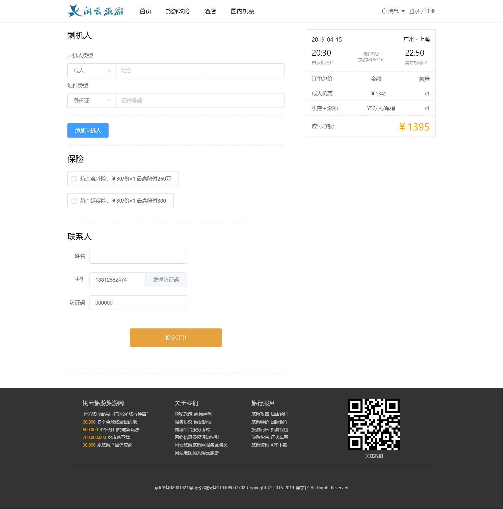
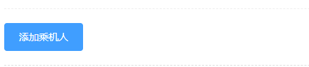
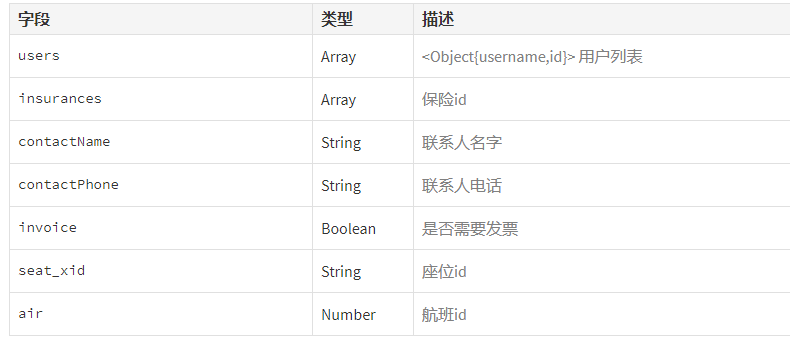
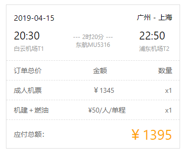

# 闲云旅游项目课程

# 机票订单页

## 重要知识点

* 表单实现逻辑
* 手机验证码
* 计算总价格





## 订单首页布局

新建`pages/air/order.vue`的代码如下

```vue
<template>
    <div class="container">
        <el-row type="flex" justify="space-between">
            <!-- 订单表单 -->
            <div class="main">
                
            </div>

            <!-- 侧边栏 -->
            <div class="aside">
                          
            </div>
        </el-row>
    </div>
</template>

<script>
export default {
    
}
</script>

<style lang="less" scoped>
    .container{
        width:1000px;
        margin:20px auto;
    }
    
    /*aside*/
    .aside{
        width: 350px;
        height: fit-content;
        border:1px #ddd solid;
    }
</style>
```


## 订单表单组件

### 思路

1. 新建表单组件
2. 添加乘机人
3. 移除乘机人
4. 渲染保险数据
5. 拼接订单数据
6. 发送手机验证码

### 实现步骤

#### 新建表单组件

1.新建订单表单组件`components/air/orderForm.vue`，添加以下内容

```vue
<template>
    <div class="main">
        <div class="air-column">
            <h2>剩机人</h2>
            <el-form class="member-info">
                <div class="member-info-item" >

                    <el-form-item label="乘机人类型">
                        <el-input placeholder="姓名" class="input-with-select">
                            <el-select 
                            slot="prepend" 
                            value="1" 
                            placeholder="请选择">
                                <el-option label="成人" value="1"></el-option>
                            </el-select>
                        </el-input>
                    </el-form-item>

                    <el-form-item label="证件类型">
                        <el-input 
                        placeholder="证件号码"  class="input-with-select">
                            <el-select 
                            slot="prepend" 
                            value="1"           
                            placeholder="请选择">
                                <el-option label="身份证" value="1" :checked="true"></el-option>
                            </el-select>
                        </el-input>
                    </el-form-item>

                    <span class="delete-user" @click="handleDeleteUser()">-</span>
                </div>
            </el-form>

            <el-button class="add-member" type='primary' @click="handleAddUsers">添加乘机人</el-button>
        </div>

        <div class="air-column">
            <h2>保险</h2>
            <div>
                <div class="insurance-item">
                    <el-checkbox 
                    label="航空意外险：￥30/份×1  最高赔付260万" 
                    border>
                    </el-checkbox> 
                </div>
            </div>
        </div>

        <div class="air-column">
            <h2>联系人</h2>
            <div class="contact">
                <el-form label-width="60px">
                    <el-form-item label="姓名">
                        <el-input></el-input>
                    </el-form-item>

                    <el-form-item label="手机">
                        <el-input placeholder="请输入内容">
                            <template slot="append">
                            <el-button @click="handleSendCaptcha">发送验证码</el-button>
                            </template>
                        </el-input>
                    </el-form-item>

                    <el-form-item label="验证码">
                        <el-input></el-input>
                    </el-form-item>
                </el-form>   
                <el-button type="warning" class="submit" @click="handleSubmit">提交订单</el-button>
            </div>
        </div>
    </div>
</template>

<script>
export default {
    methods: {
        // 添加乘机人
        handleAddUsers(){
            
        },
        
        // 移除乘机人
        handleDeleteUse(){

        },
        
        // 发送手机验证码
        handleSendCaptcha(){
            
        },

        // 提交订单
        handleSubmit(){
            
        }
    }
}
</script>

<style scoped lang="less">
    .air-column{
        border-bottom:1px #ddd dashed;
        padding-bottom: 20px;   
        margin-bottom: 20px;
    }

    .air-column h2{
        margin-bottom: 20px;
        font-size: 22px;
        font-weight: normal;
    }

    /deep/ .el-select .el-input {
        width: 130px;
    }

    .input-with-select{
        width:590px;
    }

    .input-with-select /deep/  .el-input-group__prepend {
        background-color: #fff;
    }
    .member-info /deep/ .el-form-item{
        margin-bottom:0;
    }

    .member-info-item{
        border-bottom:1px #eee dashed;
        padding-bottom: 20px;
        position: relative;

        &:first-child{
            .delete-user{
                display: none;
            }
        }
    }

    .add-member{
        margin-top:20px;
    }

    .delete-user{
        display: block;
        background:#ddd;
        width:16px;
        height:16px;
        font-size:14px;
        text-align: center;
        line-height: 16px;
        color:#fff;
        cursor: pointer;
        border-radius: 50px;
        position:absolute;
        right:-30px;
        top:50%;
    }

    .insurance{
        > div{
            margin-top:10px;
        }
    }

    .insurance-item{
        margin-bottom: 20px;
    }

    .contact{
        /deep/ .el-input{
            width:50%;
        }
    }

    .submit{
        margin: 50px auto;
        display: block;
        width:250px;
        height:50px;
    }
</style>
```


2.把组件引入到`pages/air/order.vue`中

```vue
<template>
    <div class="container">
        <el-row type="flex" justify="space-between">
            <!-- 订单表单 -->
            <OrderForm/>

            <!-- 其他代码... -->
        </el-row>
    </div>
</template>

<script>
import OrderForm from "@/components/air/orderForm.vue";

export default {
    components: {
        OrderForm
    }
}
</script>
```


#### 添加乘机人

点击该按钮添加一个新的乘机人



说明乘机人是一个列表数据，我们使用数组保存起来，但是一开始需要显示一位乘机人的位置，所以在数组初始化时候添加一位乘机人。

`components/air/orderForm.vue`

```vue
<script>
export default {
    data(){
        return {
            users: [{
                username: "",
                id: "",
            }]
        }
    },
}
</script>
```

这样点击添加按钮时候往`users`数组中添加数据即可，然后再把表单数据双向绑定到`users`

```js
// 添加乘机人
handleAddUsers(){
    this.users = [
        ...this.users, 
        {
            username: "",
            id: "",
        }
    ];
},
```

把表单字段双向绑定到`users`

```vue
<template>
<!-- 其他代码 -->

				<div 
                class="member-info-item" 
                v-for="(item, index) in users" 
                :key="index">
                    <el-form-item label="乘机人类型">
                        <el-input 
                        placeholder="姓名" 
                        v-model="item.username" 
                        class="input-with-select">
                            <el-select 
                            slot="prepend" 
                            value="1"  
                            placeholder="请选择">
                                <el-option label="成人" value="1"></el-option>
                            </el-select>
                        </el-input>
                    </el-form-item>

                    <el-form-item label="证件类型">
                        <el-input 
                        placeholder="证件号码" 
                        v-model="item.id"   
                        class="input-with-select">
                            <el-select 
                            slot="prepend" 
                            value="1" 
                            placeholder="请选择">
                                <el-option label="身份证" 
                                           value="1" 
                                           :checked="true">
    							</el-option>
                            </el-select>
                        </el-input>
                    </el-form-item>
					
                	<!-- 移除乘机人按钮 -->
                    <span class="delete-user" 
                          @click="handleDeleteUser(index)">-</span>
                </div>

<!-- 其他代码 -->
</template>
```


#### 移除乘机人

根据下标移除`users`列表的元素

```js
// 移除乘机人
handleDeleteUser(index){
    this.users.splice(index, 1);
},
```


#### 渲染保险数据

保险的数据来自于后台接口，这也是我们在`URL`中传递过来的两个参数的作用了，需要他们来请求机票相关的信息。

1.由于数据在表单组件和以后的侧边栏组件都要使用，所以在父组件中调用接口（`通常情况下都是父级调用接口比较合理`）

`components/air/order.vue`

```vue
<template>
    <div class="container">
        <el-row type="flex" justify="space-between">
            <!-- 订单表单 -->
            <OrderForm :data="infoData"/>

            <!-- 其他代码... -->
        </el-row>
    </div>
</template>
<script>
export default {
    data(){
        return {
            // 机票信息
            infoData: {
                insurances: [] // 初始化保险数据
            },
        }
    },
    
    // 其他代码...
    
    mounted(){
        const {query} = this.$route;

        this.$axios({
            url: `airs/${query.id}`,
            params: {
                seat_xid: query.seat_xid
            }
        }).then(res => {
            this.infoData = res.data;
        })
    }
}
</script>    
```


2.在表单组件中渲染保险数据

`components/air/orderForm.vue`

```vue
<template>
<!-- 其他代码 -->

		<div class="air-column">
            <h2>保险</h2>
            <div>
                <div 
                class="insurance-item"
                v-for="(item, index) in data.insurances"
                :key="index">
                    <el-checkbox 
                    :label="`${item.type}：￥${item.price}/份×${users.length}  最高赔付${item.compensation}`" 
                    border>
                    </el-checkbox> 
                </div>
            </div>
        </div>

<!-- 其他代码 -->
</template>
<script>
    export default {
		props: {
            // 接收机票信息
            data: {
                type: Object,
                default: {}
            }
        },
    }
</script>
```


#### 拼接订单数据

这是一份提交机票订单的参数文档，我们需要拼接以下的参数



拼接完后在提交事件`handleSubmit`中先打印出来。

以下代码都在`components/air/orderForm.vue`中编辑。


新增表单的字段到`data`

```js
data(){
    return {
        // 用户数据
        users: [{
            username: "",
            id: "",
        }],

        insurances: [], // 保险数据
        contactName: "", // 联系人名字
        contactPhone: "", // 联系人电话
        captcha: "000000", // 验证码
        invoice: false   // 发票
    }
},
```

> 注意`seat_xid`和`air`两个字段可以从`props`的`data`中获得


**1.用户数据**

用户数据已经保存在`users`中了


**2.保险数据**

添加多选框`change` 事件

```vue
<el-checkbox 
             :label="`${item.type}：￥${item.price}/份×${users.length}  最高赔付${item.compensation}`" 
             @change="handleInsurance(item.id)"
             border>
</el-checkbox> 
```

保险选中事件

```js
// 选择保险
handleInsurance(id){
    // 存在则去除
    if(this.insurances.indexOf(id) > -1){
        let arr = this.insurances.slice(0);
        arr.splice(this.insurances.indexOf(id), 1);
        this.insurances = arr;
    }else{ // 不存在添加到insurances
        this.insurances = [...new Set([...this.insurances, id])]
    }
},
```


**3.联系人名字/联系人手机/验证码**

```vue
<template>
<!-- 其他代码 -->

    <el-form label-width="60px">
        <el-form-item label="姓名">
            <el-input v-model="contactName"></el-input>
        </el-form-item>

        <el-form-item label="手机">
            <el-input placeholder="请输入内容" v-model="contactPhone">
                <template slot="append">
    <el-button @click="handleSendCaptcha">发送验证码</el-button>
                </template>
            </el-input>
        </el-form-item>

        <el-form-item label="验证码">
            <el-input v-model="captcha"></el-input>
        </el-form-item>
    </el-form>  

<!-- 其他代码 -->
</template>
```


**4.测试创建订单的参数**

```js
// 提交订单
handleSubmit(){
    const orderData = {
        users: this.users,
        insurances: this.insurances,
        contactName: this.contactName,
        contactPhone: this.contactPhone,
        invoice: this.invoice,
        captcha: this.captcha,
        seat_xid: this.data.seat_infos.seat_xid,
        air: this.data.id
    }

    console.log(orderData)
}
```

> 手机验证码应该是`点击发送验证码后发送到手机`的，这里我们模拟手机请求


#### 发送手机验证码

`compnents/air/orderForm.vue`

```js
// 发送手机验证码
handleSendCaptcha(){
    if(!this.contactPhone){
        this.$confirm('手机号码不能为空', '提示', {
            confirmButtonText: '确定',
            showCancelButton: false,
            type: 'warning'
        })
        return;
    }

    if(this.contactPhone.length !== 11){
        this.$confirm('手机号码格式错误', '提示', {
            confirmButtonText: '确定',
            showCancelButton: false,
            type: 'warning'
        })
        return;
    }

    this.$axios({
        url: `/captchas`,
        method: "POST",
        data: {
            tel: this.contactPhone
        }
    }).then(res => {
        const {code} = res.data;
        this.$confirm(`模拟手机验证码为：${code}`, '提示', {
            confirmButtonText: '确定',
            showCancelButton: false,
            type: 'warning'
        })
    })
},
```

> 注意目前手机验证码永远都是返回`6`个`0`


## 提交订单

上面已经准备好创建订单的数据了，接下来就提交订单了，订单提交完后会跳转到微信付款页。

`compnents/air/orderForm.vue`

```js
// 提交订单
handleSubmit(){
    const orderData = {
        users: this.users,
        insurances: this.insurances,
        contactName: this.contactName,
        contactPhone: this.contactPhone,
        invoice: this.invoice,
        captcha: this.captcha,
        seat_xid: this.data.seat_infos.seat_xid,
        air: this.data.id
    }

    const {user: {userInfo}} = this.$store.state;

    this.$message({
        message: "正在生成订单！请稍等",
        type: "success"
    })

    this.$axios({
        url: `/airorders`,
        method: "POST",
        data: orderData,
        headers: {
            Authorization: `Bearer ${userInfo.token || 'NO TOKEN'}`
        }
    }).then(res => {

        // 跳转到付款页
        this.$router.push({
            path: "/air/pay"
        });
    }).catch(err => {
        const {message} = err.response.data;
        // 警告提示
        this.$confirm(message, '提示', {
            confirmButtonText: '确定',
            showCancelButton: false,
            type: 'warning'
        })
    })
}
```


## 侧边栏组件

侧边栏组件是一个负责展示的组件，其中总价需要在订单表单组件中计算得出，再传递过来。



### 思路

1. 新建侧边栏组件
2. 计算总额


### 实现步骤

#### 新建侧边栏组件

1.新建订单表单组件`components/air/orderAside.vue`，添加以下内容

```vue
<template>
    <div class="aside">
        <div class="air-info">
            <el-row type="flex" justify="space-between" class="info-top">
                <div>{{data.dep_date}}</div>
                <div>{{data.org_city_name}} - {{data.dst_city_name}}</div>
            </el-row>    
            <el-row 
            type="flex" 
            justify="space-between" 
            align="middle" 
            class="info-step">
                <el-col :span="5" class="flight-airport">
                    <strong>{{data.dep_time}}</strong>
                    <span>{{data.org_airport_name}}{{data.org_airport_quay}}</span>
                </el-col>
                <el-col :span="14" class="flight-time">
                    <span>--- {{rankTime}} ---</span>
                    <span>{{data.airline_name}}{{data.flight_no}}</span>
                </el-col>
                <el-col :span="5" class="flight-airport">
                    <strong>{{data.arr_time}}</strong>
                    <span>浦东机场T2</span>
                </el-col>
            </el-row> 
        </div>
        <el-row type="flex" justify="space-between" class="info-bar">
            <span>订单总价</span>
            <span>金额</span>
            <span>数量</span>
        </el-row>
        <el-row type="flex" justify="space-between" class="info-bar">
            <span>成人机票</span>
            <span>￥{{data.seat_infos.org_settle_price}}</span>
            <span>x1</span>
        </el-row>
        <el-row type="flex" justify="space-between" class="info-bar">
            <span>机建＋燃油</span>
            <span>¥{{data.airport_tax_audlet}}/人/单程</span>
            <span>x1</span>
        </el-row>
        <el-row type="flex" justify="space-between" align="middle" class="info-bar">
            <span>应付总额：</span>
            <span class="price">￥ </span>
        </el-row>           
    </div>
</template>

<script>
export default {
    props: {
        data: {
            type: Object,
            default: {}
        }
    },

    computed: {
        rankTime(){
            // 数据还未请求回来
            if(!this.data.dep_time) return "";

            // 转化为分钟
            const dep = this.data.dep_time.split(":");
            const arr = this.data.arr_time.split(":");
            const depVal = dep[0] * 60 + +dep[1];
            const arrVal = arr[0] * 60 + +arr[1];

            // 到达时间相减得到分钟
            let dis = arrVal - depVal;

            // 如果是第二天凌晨时间段，需要加24小时
            if(dis < 0){
                dis = arrVal + 24 * 60 - depVal;
            }

            // 得到相差时间
            return `${ Math.floor(dis / 60)}时${dis % 60}分`
        }
    },
}
</script>

<style scoped lang="less">
/*aside*/
.aside{
    width: 350px;
    height: fit-content;
    border:1px #ddd solid;
}

.air-info{
    padding:15px;

    .info-top{
        margin-bottom:10px;
        > div:last-child{
            font-size:14px;
        }
    }

    .info-step{
        .flight-airport{
            strong{
                display: block;
                font-size: 22px;
                font-weight: normal;
            }

            span{
                font-size: 12px;
                color:#999;
            }
        }

        .flight-time{
            text-align: center;
            font-size: 12px;
            color:#999;
            span{
                display: block;
            }
        }
    }
}

.info-bar{
    border-top:1px #ddd dashed;
    padding: 10px 15px;
    font-size: 14px;
    color: #666;

    .price{
        font-size:28px;
        color: orange;
    }
}
</style>
```

> 这里的数据展示和功能几乎都是和`机票列表`是重复的


2.把组件引入到`pages/air/order.vue`中

```vue
<template>
    <div class="container">
        <el-row type="flex" justify="space-between">
            <!-- 其他代码... -->

            <!-- 侧边栏 -->
            <OrderAside :data="infoData"/>
        </el-row>
    </div>
</template>

<script>
import OrderForm from "@/components/air/orderForm.vue";
import OrderAside from "@/components/air/OrderAside.vue";

export default {
    data(){
        return {
            // 机票信息
            infoData: {
                insurances: [], // 初始化保险数据
                seat_infos: {}
            },
        }
    },
    components: {
        OrderForm,
        OrderAside
    },
    
    // 其他代码...
}
</script>
```


####  计算总额

总金额要使用兄弟组件传值的方式。

在订单表单组件中计算总金额，并传递给父组件 


**1.父组件**

`pages/air/order.vue`

```vue
<template>
    <div class="container">
        <el-row type="flex" justify="space-between">
            <!-- 订单表单 -->
            <OrderForm :data="infoData" @setAllPrice="setAllPrice"/>

            <!-- 侧边栏 -->
            <OrderAside :data="infoData" :allPrice="allPrice"/>
        </el-row>
    </div>
</template>
<script>
// 其他代码...

export default {
    data(){
        return {
            // 机票信息
            infoData: {
                insurances: [], // 初始化保险数据
                seat_infos: {}
            },

            allPrice: 0
        }
    },
    
    // 其他代码...

    methods: {
        setAllPrice(price){
            this.allPrice = price;
        }
    }
}
</script>
```


**2.订单表单组件**

`components/air/orderForm.vue`

```js
computed: {
    // 计算总价格
    allPrice(){
        console.log(123)
        let price = 0;
        let len = this.users.length;

        price += this.data.seat_infos.org_settle_price * len;

        this.insurances.forEach(v => {
            price += this.data.insurances[v - 1].price * len;
        });

        price += this.data.airport_tax_audlet * len;
		
        // 触发设置总金额事件
        this.$emit("setAllPrice", price)

        return price;
    }
},
```

`computed`计算属性的值如果页面中没引用的话函数是不会执行的，所以需要在页面中调用下`allPrice`.

在页面的`template`中任意位置加以下代码

```vue
<input type="hidden" :value="allPrice">
```


**3.订单侧边栏组件**

```vue
<template>
 <!-- 其他代码... -->

	<span class="price">￥ {{allPrice}} </span>

 <!-- 其他代码... -->
</template>
<script>
export default {
    props: {
        // 其他代码...
		
        // 总金额
        allPrice: {
            type: Number,
            default: 0
        }
    },
   
    // 其他代码...
}
</script>
```


