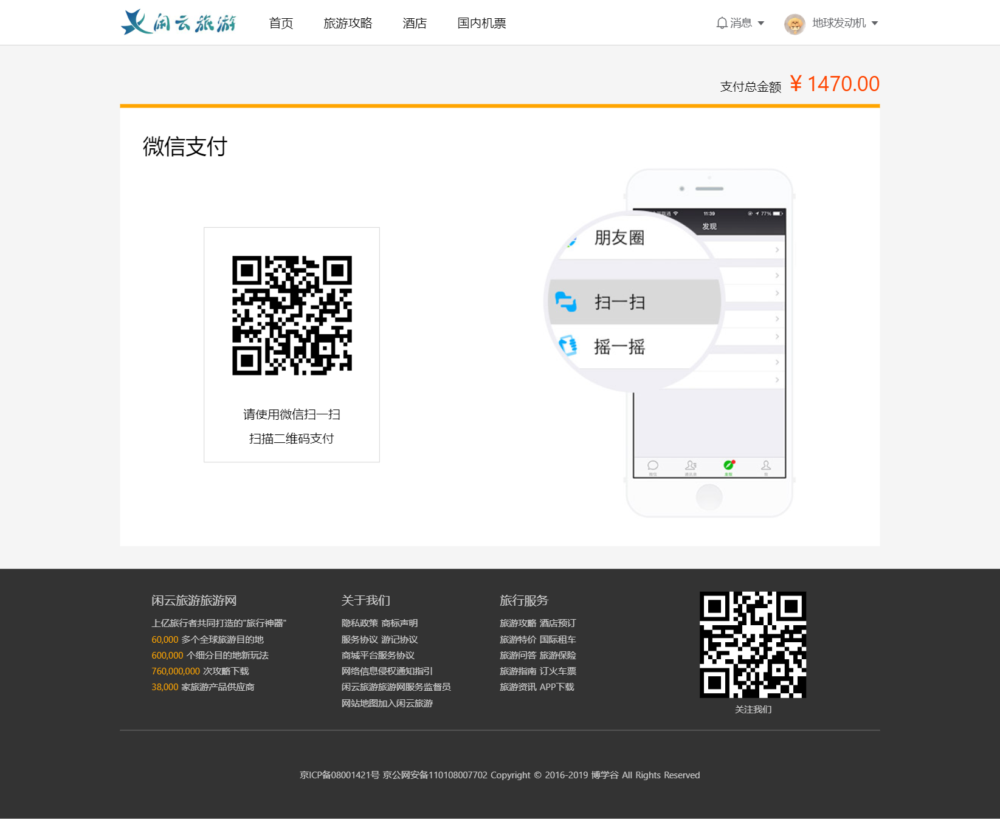
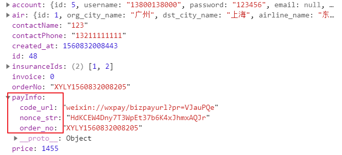

# 闲云旅游项目课程

# 机票付款页

## 重要知识点

* 前端生成二维码
* 付款结果轮询





## 基本布局

新建机票付款页`pages/air/pay.vue`，代码如下

```vue
<template>
    <div class="container">
        <div class="main">
            <div class="pay-title">
                支付总金额 <span class="pay-price">￥ 1000</span>
            </div>
            <div class="pay-main">
                <h4>微信支付</h4>
                <el-row type="flex" 
                justify="space-between" 
                align="middle"
                class="pay-qrcode">
                    <div class="qrcode">
                        <!-- 二维码 -->
                        <canvas id="qrcode-stage"></canvas>
                        <p>请使用微信扫一扫</p>
                        <p>扫描二维码支付</p>
                    </div>
                    <div class="pay-example">
                        
                    </div>
                </el-row>
            </div>
        </div>
    </div>
</template>

<script>
export default {
    
}
</script>

<style scoped lang="less">
.container{
    background:#f5f5f5;
    padding: 30px 0;

    .main{
        width:1000px;
        margin:0 auto;

        .pay-title{
            text-align: right;
            span{
                font-size:28px;
                color:orangered;
            }
        }

        .pay-main{
            background:#fff;
            margin-top:10px;
            border-top: 5px orange solid;
            padding:30px;

            h4{
                font-size: 28px;
                font-weight: normal;
                margin-bottom: 10px;
            }

            .pay-qrcode{
                padding:0 80px;
            }

            .qrcode{
                border:1px #ddd solid;
                padding:15px;
                height: fit-content;

                #qrcode-stage{
                    width:200px;
                    height:200px;
                    margin-bottom: 10px;
                }

                p{
                    line-height: 2;
                    text-align: center;
                }
            }
        }
    }
}
</style>
```


## 生成二维码

### 思路

1. 获取订单`id`
2. 获取订单详情
3. 生成二维码


### 实现步骤

#### 获取订单`id`

获取订单详情的接口需要使用订单`id`。

订单`id`是在提交订单成功时返回的，所以要回到`components/air/orderForm.vue`中处理下跳转，给参数带上订单`id`

`components/air/orderForm.vue`

```js
// 提交订单
        handleSubmit(){
            // 其他代码...

            this.$axios({
                // 其他代码...
            }).then(res => {
                const {data: {id}} = res.data;

                // 跳转到付款页
                this.$router.push({
                    path: "/air/pay",
                    query: {
                       id
                    }
                });
            })
            // 其他代码...
        }
```


#### 获取订单详情

`pages/air/pay.vue`

 ```js
<script>
export default {
    mounted(){
        // 这个处理方法是有缺陷的，不100%准确
		// userInfo在页面加载完才赋值
        setTimeout(v => {
            const {id} = this.$route.query;   
            const {user: {userInfo}} = this.$store.state;

             // 请求二维码
            this.$axios({
                url: `airorders/${id}`,
                headers: {
                    Authorization: `Bearer ${userInfo.token}`
                }
            }).then(res => {
                
                console.log(res)
                
            })
        }, 200);
    }
}
</script>
 ```

结果中的`payInfo`字段就是付款链接，需要根据链接生成二维码




> 注意：把价格展示到页面上，这里不添加详细步骤了。


#### 生成二维码

下载第三方的生成二维码包

```
npm install --save qrcode
```

导入到页面中并使用

`pages/air/pay.vue`

```vue
<script>
// 生成二维码的包
import QRCode from "qrcode";

export default {
    mounted(){
        // 这个处理方法是有缺陷的，不100%准确
        // userInfo在页面加载完才赋值
        setTimeout(v => {
            const {id} = this.$route.query;   
            const {user: {userInfo}} = this.$store.state;

             // 请求二维码
            this.$axios({
                url: `airorders/${id}`,
                headers: {
                    Authorization: `Bearer ${userInfo.token}`
                }
            }).then(res => {
                // price 用于展示
                const {payInfo, price} = res.data;

                // 生成二维码到canvas
                const stage = document.querySelector("#qrcode-stage");
                QRCode.toCanvas(stage, payInfo.code_url, {
                    width: 200
                }); 
            })
        }, 200);
    }
}
</script>
```

现在页面应该能看到支付二维码了，请用微信扫扫并付款。


### 总结

掌握使用`qrcode`前端生成二维码。


##  支付结果轮询

在付款页需要服务器实时推送信息给客户端，检查是否付款成功然后执行对应的操作，这里我们采用`轮询的方式`调用查询订单状态接口。

`pages/air/pay.vue`

```VUE
<script>
// 其他代码...

export default {
    data(){
        return {
            timer: null
        }
    },

    methods: {
        // 检查付款状态
        async isPay(data){
            const {id} = this.$route.query; 
            const {api, user: {userInfo}} = this.$store.state;

            return this.$axios({
                url: `airorders/checkpay`,
                method: "POST",
                data: {
                    id,
                    nonce_str: data.nonce_str,
                    out_trade_no: data.order_no
                },
                headers: {
                    Authorization: `Bearer ${userInfo.token}`
                }
            }).then(res => {
                const {statusTxt} = res.data;

                if(statusTxt === "支付完成"){
                     this.$confirm("订单支付成功", '提示', {
                        confirmButtonText: '确定',
                        showCancelButton: false,
                        type: 'success'
                    });

                    return Promise.resolve(true);
                }

                return Promise.resolve(false)
            })
        }
    },

    destroyed(){
        clearInterval(this.timer)
    },

    mounted(){
        setTimeout(v => {
            // 其他代码...
            
            this.$axios({
               // 其他代码...
            }).then(res => {
                // 其他代码...

                this.timer = setInterval(async () => {
                    const isResolve = await this.isPay(payInfo);
                    console.log(isResolve)
                    if(isResolve){
                        clearInterval(this.timer)
                        return;
                    }
                }, 3000)
            })
        }, 200);
    }
}
</script>
```


查询接口`3`秒查询一次，如果已付款会弹窗提示并停止继续查询，页面销毁也会停止查询。

